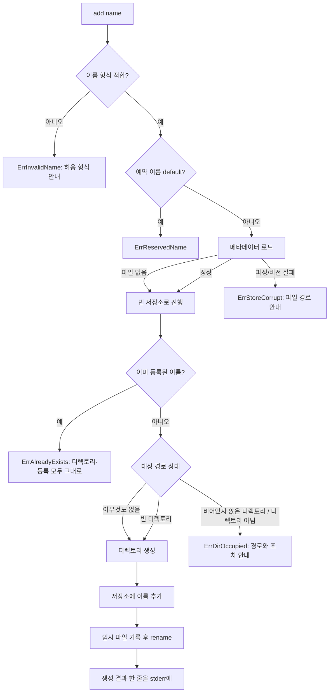

# profile-store — ANALYSIS

## 근거

읽은 문서

- `features/20260727-001-profile-store/spec.md` 전체 (§1 범위·입력 맥락, §2 목표, §3 제약,
  §4 제외 범위, §5 완료 조건 12개)
- 루트 `README.md`, `ROADMAP.md` — 최종 결과물, 서비스 완료 기준, 마일스톤 M1~M4,
  최종 관문(플랫폼 분기와 순수 로직 분리, macOS는 CI 검증, 삭제가 링크를 따라가지 않을 것)

저장소 탐색으로 확인한 사실

- `.go` 파일과 `go.mod`·`go.sum`이 하나도 없다. 루트에는 `.git`, `.gitignore`, `README.md`,
  `ROADMAP.md`, `features/`만 있다. 커밋 이력은 문서 커밋 2개뿐이다.
- 따라서 기존 호출자·구현체·참조가 없고, 깨질 저장 데이터나 외부 계약도 없다.
- `.gitignore`가 이미 `/ccswitch`와 `/ccswitch.exe`를 무시한다. 빌드 산출물이 저장소 루트에
  떨어지는 것을 전제한 설정이므로, `main` 패키지를 루트에 두는 배치와 맞는다.
- `git remote origin`은 `https://github.com/zipkero/ccswitch.git`이다. 모듈 경로를
  `github.com/zipkero/ccswitch`로 확정할 근거가 된다.
- 로컬 Go 툴체인은 `go1.26.5 windows/amd64`다.

사용자가 실측으로 전달한 환경 사실 (이 분석에서 재현하지 않았다)

- Claude Code 2.1.220 / Windows 11에서 `CLAUDE_CONFIG_DIR`을 빈 디렉토리로 지정해 실행하면
  그 디렉토리에 새 `.claude.json`이 생기고 홈 루트의 `~/.claude.json`은 참조되지 않는다.
- Windows에서 자격증명은 설정 디렉토리 안 `.credentials.json` 평문 파일이다.
- Windows에서 관리자 권한 없이 디렉토리 junction과 파일 hardlink는 만들 수 있고, 파일
  symlink는 만들 수 없다. 이번 범위에는 링크 생성이 없으므로 구조 판단의 배경으로만 썼다.

참고 구현에서 읽은 것 (`binoyPeries/ccswitch`, 설계 참고만 하고 코드는 가져오지 않는다)

- `internal/profile/paths.go` — `runtime.GOOS` 분기로 홈·설정 디렉토리를 직접 구하고,
  프로필 디렉토리를 `<home>/.claude-<name>`, 메타데이터를 `<config>/ccswitch/profiles.json`에
  둔다. Unix 설정 위치로 `~/.config`를 쓴다.
- `internal/profile/store.go` — `profiles.json`을 통째로 읽고 쓰는 인메모리 저장소.
  파일 없음은 오류가 아니고, 저장은 임시 파일 + rename이다. 임시 파일 이름이 고정
  `.tmp`이고 `O_EXCL`이라, 이전 크래시로 남은 임시 파일이 이후 저장을 계속 막는다.
- `cmd/errors.go` — sentinel error를 종료 코드로 매핑하는 단일 함수.
- `cmd/rm.go` — 항상 프롬프트를 띄우고 `y`/`yes`만 승인으로 본다. 확인 생략 플래그가 없고,
  비대화형 입력이면 EOF를 거부로 처리한다. 커맨드가 패키지 수준 전역 변수다.

표준 라이브러리 동작 (Go 문서 기준이며 이 분석에서 실행 검증하지 않았다)

- `os.UserHomeDir()`는 Windows에서 `%USERPROFILE%`, 그 외에서 `$HOME`을 돌려준다.
- `os.UserConfigDir()`는 Windows에서 `%AppData%`, macOS에서 `~/Library/Application Support`,
  Linux에서 `$XDG_CONFIG_HOME` 또는 `~/.config`를 돌려준다.
- `os.Rename`은 Windows에서 대상 파일이 이미 있어도 교체한다. 다른 프로세스가 대상 파일을
  열고 있으면 공유 위반으로 실패할 수 있다.
- `os.MkdirAll`의 퍼미션 인자는 Windows에서 사실상 무시되고 디렉토리는 부모 ACL을 상속한다.

## 1. 구조

세 개의 경계로 나눈다.

**도메인·저장소 경계** — 프로필이 무엇이고 어디에 있으며 지금 어떤 상태인지에 대한 단일
기준을 소유한다. 이름 규칙과 예약 이름, 경로 산출, 등록 정보의 읽기·쓰기, 실제 디렉토리
상태 판정이 여기 있다. 파일시스템과 사용자 설정 위치를 제외한 어떤 외부와도 이야기하지
않고, 종료 코드나 출력 형식을 알지 못한다. 다음 feature인 profile-launcher가 실행 대상을
정할 때 읽는 것이 정확히 이 경계이므로(SPEC §1), CLI가 아니라 여기가 공개 계약이다.

**CLI 경계** — 인자 파싱, 서브커맨드 배치, 확인 프롬프트, 사람이 읽는 출력, 도메인 error를
메시지와 종료 코드로 옮기는 일을 소유한다. 도메인 규칙을 다시 판단하지 않는다.

**진입점** — 저장소 루트의 `main` 패키지. 실행 환경에서 경로 기준값을 한 번 만들고, 표준
입출력 스트림과 함께 CLI 경계에 넘긴 뒤, 돌아온 error를 종료 코드로 바꿔 프로세스를 끝낸다.
프로세스 종료를 아는 유일한 곳이다.

배치는 루트 `main.go`, `internal/cli`, `internal/profile`이다. 루트를 `main` 패키지로 두는
것은 `go install github.com/zipkero/ccswitch@latest`가 `ccswitch` 바이너리를 그대로 내놓게
하려는 것이고(ROADMAP의 제공 수준이 소스 공개와 `go install` 안내다), 이미 `.gitignore`가
루트 산출물을 무시하고 있다는 사실과도 맞는다.

모듈 경로는 `github.com/zipkero/ccswitch`다. `go` 지시자는 로컬 툴체인(1.26.5)이 아니라
`go 1.24`로 낮춰 선언한다. 이 feature는 새 언어 기능을 쓰지 않고, 지시자를 높게 잡으면 조금
오래된 툴체인을 가진 사용자가 `go install`에서 막히기 때문이다.

경로 기준값은 `Layout` 값 하나로 모은다. 홈 루트와 사용자 설정 루트 두 개를 담고, 프로필
디렉토리·기본 설정 디렉토리·메타데이터 파일 경로는 모두 이 값에서 순수 계산으로 나온다.
플랫폼에 따라 갈리는 부분은 이 값을 만드는 생성자 한 곳뿐이며, 나머지 로직은 어느 환경에서도
같은 코드로 돈다. ROADMAP 최종 관문의 "플랫폼 의존 부분과 순수 로직 분리"를 이 경계가 맡는다.

## 2. 데이터 흐름

### 공통 경로

진입점이 `Layout`을 만들고 표준 입출력과 함께 커맨드 트리를 구성한다. 서브커맨드는 도메인
경계를 호출하고 성공이면 `nil`, 실패면 sentinel을 감싼 error를 돌려준다. CLI 경계가 그
error를 한 줄 메시지로 stderr에 쓰고 종료 코드로 매핑하며, 진입점이 그 코드로 종료한다.
stdout에는 `list`의 표만 나가고, 진행·경고·오류·프롬프트는 전부 stderr로 간다.

`Layout` 구성 자체가 실패할 수 있다(홈 디렉토리나 설정 루트를 못 구하는 경우). 이때는 어떤
커맨드도 실행하지 않고 즉시 오류로 끝난다.

### add



이름 검증이 파일시스템과 메타데이터 접근보다 먼저 끝나므로, 잘못된 이름이나 예약 이름은
디스크를 전혀 건드리지 않고 거부된다(SPEC §5.2, §5.3). 이미 등록된 이름은 경로 조사 전에
막혀 기존 디렉토리와 등록 내용이 그대로 남는다(SPEC §5.4). 대상 자리에 내용이 있는
디렉토리가 있으면 그 안을 읽지도 지우지도 않고 실패하며, 메시지에 경로와 사용자가 할 수
있는 일(다른 이름을 쓰거나 그 디렉토리를 직접 정리)이 함께 나간다(SPEC §5.5). 여기까지
통과하면 디렉토리가 생기고 등록이 이어지므로 직후 `list`에 이름과 경로가 나타난다
(SPEC §5.1).

빈 디렉토리가 이미 있는 경우를 통과시키는 것은 의도적이다. 디렉토리 생성 후 메타데이터
저장이 실패하면 빈 디렉토리만 남는데, 다시 `add`를 실행하면 이 경로로 회복된다.

### list

메타데이터를 읽고(파일이 없으면 빈 목록), 합성한 `default` 행을 맨 위에 놓은 뒤 등록된
이름을 사전순으로 정렬해 붙인다. 행마다 디렉토리를 한 번 조사해 상태를 붙이고, 열 맞춘
표를 stdout에 낸다. 등록된 프로필이 하나도 없어도 `default` 행이 있으므로 출력이 비지
않고 성공으로 끝난다(SPEC §5.6). 디렉토리 조사 결과가 무엇이든 `list` 자체는 실패하지
않으며, 어떤 프로필이 정상이 아닌지는 상태 열로 구별된다(SPEC §5.12). `list`는 어떤 상태도
고쳐 쓰지 않는다 — 사라진 디렉토리를 보고 등록을 지우거나 디렉토리를 다시 만들지 않는다.

정렬을 등록 순서가 아니라 사전순으로 두는 것은 출력이 항상 같은 순서가 되게 해서 눈으로
비교하기 쉽고 테스트에서 기대값을 고정할 수 있게 하려는 것이다.

### rm

예약 이름을 가장 먼저 거부한다. 저장소를 읽기도 전에 막히므로 기본 설정 디렉토리는 어떤
경로로도 삭제 대상이 되지 않는다(SPEC §5.10). 다음으로 이름 형식을 검증하고, 그다음
등록 여부를 본다. 등록되지 않은 이름은 여기서 끝난다(SPEC §5.9).

확인 단계는 세 갈래다. 확인 생략 플래그가 있으면 바로 진행한다. 없고 표준 입력이
대화형이면 삭제 대상 이름과 경로를 보여주고 명시적 승인을 요구한다. 없고 표준 입력이
대화형이 아니면(파이프·CI) 아무것도 지우지 않고 실패하며, 생략 플래그를 쓰라고 안내한다.
승인 전에는 디렉토리와 등록 항목 어느 쪽도 손대지 않고, 생략 경로는 프롬프트 없이
진행된다(SPEC §5.7).

승인 후에는 디렉토리를 먼저 지우고 그다음 등록을 지운다. 둘 다 끝나면 이후 `list`에 그
이름이 나타나지 않는다(SPEC §5.8). 순서의 근거는 D14에 있다.

### 프로필 상태

등록 정보와 실제 디렉토리는 언제든 어긋날 수 있다. 상태는 저장되지 않고 조회 시점에
경로를 조사해 계산한다.

| 상태 | 조건 | 어떻게 도달하는가 |
|---|---|---|
| `ok` | 경로에 디렉토리가 있다 | `add` 성공 후 정상 상태 |
| `missing` | 경로에 아무것도 없다 | 사용자가 디렉토리를 밖에서 지웠다 / 저장 후 생성 실패 |
| `unusable` | 경로에 디렉토리가 아닌 것이 있거나 조사할 수 없다 | 같은 이름의 파일이 놓였다 / 접근 권한 문제 |

`default` 행도 같은 규칙으로 판정한다. Claude Code를 한 번도 쓰지 않은 머신에서는
`default`가 `missing`으로 보이며 이는 정확한 사실이다.

## 3. 인터페이스

### CLI 표면

```
ccswitch add <name>
ccswitch list
ccswitch rm <name> [--yes|-y]
```

`add`와 `rm`은 인자 정확히 하나, `list`는 인자 없음. `--help`는 프레임워크가 제공한다.
이번 범위에는 `--version`도, 기계 판독용 출력 플래그도 두지 않는다(SPEC §4).

`list` 출력은 stdout으로 나가는 열 맞춘 표이며 헤더 한 줄과 행들로 이루어진다.

```
NAME     DIR                             STATUS
default  C:\Users\me\.claude             ok
work     C:\Users\me\.claude-work        missing
```

### 종료 코드

| 코드 | 의미 |
|---|---|
| 0 | 성공. 사용자가 `rm` 확인 프롬프트에서 취소한 경우도 포함한다 |
| 1 | 그 밖의 실패. 입출력 오류, 메타데이터 손상, 경로 기준값 산출 실패 |
| 2 | 인자·이름 오류. 잘못된 사용법, 이름 형식 위반, 예약 이름, 비대화형에서 확인 생략 플래그 누락 |
| 3 | 등록되지 않은 프로필 |
| 4 | 이미 등록된 이름 |
| 5 | 대상 경로가 이미 점유됨 |

6 이후는 다음 feature들이 쓰도록 비워 둔다. 매핑은 CLI 경계가 sentinel error를 보고 하며,
도메인 경계는 종료 코드를 알지 못한다.

### 메타데이터 파일 형식

```json
{
  "version": 1,
  "profiles": [
    { "name": "side" },
    { "name": "work" }
  ]
}
```

파일이 없는 것은 오류가 아니라 "등록된 프로필 없음"이다. `version`이 1이 아니면 추측해서
읽지 않고 거부한다. 항목을 객체로 두는 것은 M2에서 계정 정보 같은 필드가 붙어도 형식
자체는 유지되게 하려는 것이다. 디렉토리 경로는 저장하지 않는다(D4).

### 도메인 경계가 노출하는 계약

profile-launcher가 이 계약을 그대로 소비한다.

```go
// 경로 기준값
type Layout struct {
    Home       string // 프로필 디렉토리의 부모
    ConfigRoot string // 메타데이터가 놓이는 사용자 설정 루트
}
func NewLayout() (Layout, error)
func (l Layout) ProfileDir(name string) string
func (l Layout) DefaultDir() string
func (l Layout) MetadataPath() string

// 이름 규칙
const DefaultName = "default"
func ValidateName(name string) error // ErrInvalidName / ErrReservedName

// 등록 정보
type Store struct{ /* 비공개 */ }
func Load(path string) (*Store, error)
func (s *Store) Save() error
func (s *Store) Names() []string
func (s *Store) Has(name string) bool
func (s *Store) Add(name string) error    // ErrAlreadyExists
func (s *Store) Remove(name string) error // ErrNotFound

// 실제 상태
type Status int // StatusOK, StatusMissing, StatusUnusable
func Inspect(dir string) Status

// sentinel
var ErrInvalidName, ErrReservedName, ErrNotFound,
    ErrAlreadyExists, ErrDirOccupied, ErrStoreCorrupt error
```

CLI 경계는 의존성을 값으로 받는 생성자 하나를 노출한다. 경로 기준값과 입력·출력·오류
스트림을 받아 커맨드 트리를 만들어 돌려주고, error를 종료 코드로 옮기는 함수를 함께 둔다.
전역 상태를 두지 않으므로 테스트가 매번 새 커맨드 트리를 만들 수 있다.

## 4. 영향 범위

기존 코드에 대한 영향은 해당 없음. 저장소에 `.go` 파일과 `go.mod`가 하나도 없고 커밋
이력이 문서 두 개뿐임을 탐색으로 확인했다(§근거). 변경 대상의 호출자·구현체·참조가
존재하지 않으므로 하위 호환·마이그레이션 항목도 해당 없음이다.

이 feature는 `go.mod`를 새로 만들며, 이 저장소에서 처음으로 Go 모듈 경계를 정의한다.
이후 모든 feature가 그 모듈 안에 들어간다.

기존 파일 중 수정이 필요한 것은 없다. `.gitignore`는 이미 Go 빌드 산출물과 테스트 출력,
`go.work`를 덮고 있어 그대로 쓴다. 루트 `README.md`와 `ROADMAP.md`는 이 feature가 손대지
않는다 — README의 상태 문구는 M1의 실행 경로(profile-launcher)까지 끝난 뒤에 다룰 일이다.

## 5. Decision Points

### D1 — 등록 정보를 별도 파일로 둘지, 디렉토리 스캔으로 대체할지

- 옵션 A: 홈 아래 `.claude-*` 디렉토리를 스캔해 프로필 목록을 만든다. 대가: 등록 정보와
  실체가 어긋날 수 없다는 장점이 있지만, "등록되어 있는데 디렉토리가 없는" 상태를 표현할
  방법 자체가 사라진다. ccswitch가 만들지 않은 디렉토리도 프로필로 잡힌다.
- 옵션 B: 등록 정보를 별도 파일에 둔다. 대가: 파일과 실체가 어긋나는 상태를 다뤄야 하고
  쓰기 원자성이 문제가 된다.
- 채택: B.
- 근거: SPEC §5.12가 등록된 프로필의 디렉토리가 밖에서 지워진 상태를 `list`에서 구별할 수
  있어야 한다고 요구한다. 스캔 방식은 이 상태를 만들 수 없으므로 요구를 원리적으로 충족할
  수 없다. SPEC §5.4의 "이미 등록됨"도 등록이라는 별도 개념이 있어야 성립한다.

### D2 — 메타데이터의 위치와 파일 스키마

- 옵션 A: 플랫폼별로 직접 분기해 Windows는 `%AppData%`, Unix는 `~/.config`를 쓴다(참고
  구현 방식). 대가: macOS CLI 관례에 가깝지만 `runtime.GOOS` 분기를 직접 들고 있어야 한다.
- 옵션 B: `os.UserConfigDir()`에 맡긴다. 대가: macOS에서 `~/Library/Application Support`가
  되어 CLI 관례와 갈린다. Windows에서 로밍 프로필 환경이면 파일이 다른 머신으로 동기될 수
  있는데, 프로필 디렉토리는 로밍되지 않으므로 그쪽에서는 등록만 있고 실체가 없는 상태가 된다.
- 채택: B. 파일은 `<설정 루트>/ccswitch/profiles.json`, 스키마에 `version` 필드를 둔다.
- 근거: SPEC §3이 "플랫폼의 표준 사용자 설정 위치"를 요구하고, 표준 라이브러리의 정의가
  바로 그것이다. 분기를 직접 들지 않으면 M4까지 유지할 코드가 줄어든다. 로밍으로 인한
  불일치는 D10의 `missing` 상태로 이미 정직하게 드러나므로 피해가 갇혀 있다. macOS 위치는
  M4에서 다시 볼 수 있고, 그 시점까지 macOS 사용자가 없으므로 이전 비용이 0이다.
  `version` 필드는 지금 한 줄이면 되지만 나중에 붙이려면 "필드 없음"을 1로 간주하는 추론이
  필요해진다.

### D3 — `default`를 실체로 저장할지 합성 항목으로 둘지

- 옵션 A: 첫 실행 때 `default` 항목을 메타데이터에 기록한다. 대가: 목록 구성 코드가
  단순해지지만, 기록된 경로가 실제 기본 설정 디렉토리와 어긋날 수 있고 사용자가 파일을
  손으로 고쳐 `default`를 지우거나 옮길 수 있다.
- 옵션 B: 저장하지 않고 조회 시점에 합성한다. 대가: 목록을 만드는 쪽이 항상 합성 행을
  붙여야 하고, 그 규칙이 CLI가 아니라 도메인 경계에 있어야 launcher도 같은 답을 얻는다.
- 채택: B. `default`의 경로는 홈 아래 `.claude`로 고정하고, 실행 환경의
  `CLAUDE_CONFIG_DIR`은 보지 않는다.
- 근거: SPEC §3이 `default`를 사용자 프로필이 아니라 Claude Code의 기본 설정 디렉토리를
  가리키는 항목으로 정의한다. 저장하지 않으면 등록 목록이 비어 있어도 `default`가 나오는
  SPEC §5.6이 자연히 성립하고, 예약 이름 검사만으로 SPEC §5.3과 §5.10이 함께 막힌다.
  환경변수를 보지 않는 것은 `list` 출력이 셸 환경에 따라 달라지지 않게 하기 위해서이며,
  실행 시점에 환경변수를 다루는 일은 profile-launcher 소관이다.

### D4 — 프로필 디렉토리 경로를 저장할지 이름에서 파생할지

- 옵션 A: 등록 항목에 절대 경로를 저장한다(참고 구현 방식). 대가: 나중에 사용자 지정 위치를
  지원하기 쉽지만, `rm`이 재귀 삭제할 경로가 파일 내용에서 온다. 손으로 고쳤거나 손상된
  파일이 삭제 대상을 임의의 위치로 돌릴 수 있다.
- 옵션 B: 이름에서 매번 계산한다. 대가: 사용자 지정 위치를 지원하려면 형식 변경이 필요하다.
- 채택: B.
- 근거: `rm`은 되돌릴 수 없는 재귀 삭제를 하고 그 안에는 자격증명과 세션 기록이 있다
  (SPEC §3). 삭제 대상이 검증된 이름과 홈 루트에서 계산된 값이면 영향 범위가 구조적으로
  묶인다. 사용자 지정 위치는 SPEC §4와 ROADMAP 어디에도 없는 요구이고, 필요해지면 D2의
  `version` 필드로 형식을 올릴 수 있다.

### D5 — 프로필 디렉토리 레이아웃

- 옵션 A: 홈 아래 `.claude-<name>`. 대가: 홈 디렉토리에 항목이 늘어난다. 대신 이름만 봐도
  Claude Code 설정 디렉토리임이 드러나고, ccswitch를 지워도 남은 디렉토리의 정체가 분명하다.
- 옵션 B: 홈 아래 `.ccswitch/profiles/<name>`. 대가: 홈이 깔끔하고 삭제 범위가 한 디렉토리
  아래로 묶인다. 대신 Claude Code 설정 디렉토리가 ccswitch 소유 디렉토리 안에 들어가,
  ccswitch를 지우려는 사용자가 계정 데이터까지 함께 지우기 쉬워진다.
- 옵션 C: 기본 설정 디렉토리 안에 `~/.claude/profiles/<name>`. 대가: 설정 디렉토리 안에
  설정 디렉토리가 중첩되어 `default` 삭제가 모든 프로필을 함께 날린다.
- 채택: A. 사용자 확인을 거쳐 확정했다.
- 근거: C는 중첩 자체가 사고를 만든다. A와 B의 삭제 범위 차이는 D4(경로 파생)와 D7(이름
  규칙)이 이미 막고 있어 안전성 면에서는 사실상 같아지고, 남는 차이는 사용자가 홈을 열어
  봤을 때 그 디렉토리가 무엇인지 바로 아는가다. SPEC §3의 "홈 아래에 프로필 이름으로
  구분되는 경로"를 그대로 만족한다. 참고 구현과 같은 레이아웃이라 이미 그 도구를 쓰던
  사용자에게도 낯설지 않다.

### D6 — 플랫폼 분기의 경계

- 옵션 A: `runtime.GOOS` 스위치와 환경변수 조회를 경로 계산 함수 안에 둔다(참고 구현 방식).
  대가: 분기가 로직과 섞여 테스트할 때 환경변수를 바꿔야 한다.
- 옵션 B: 플랫폼별 빌드 태그 파일로 나눈다. 대가: Windows에서 macOS 분기를 컴파일조차 하지
  않게 되어, 실기 없이는 그쪽 코드가 깨진 것도 모른다.
- 옵션 C: 경로 기준값을 값 하나로 모으고, 플랫폼에 의존하는 것은 그 값을 만드는 생성자
  한 곳에만 둔다. 대가: 값을 모든 호출 지점에 넘겨야 한다.
- 채택: C. 그리고 이번 범위에서는 생성자조차 `runtime.GOOS` 스위치를 갖지 않는다. 홈과
  설정 루트를 표준 라이브러리에 맡기면 분기가 라이브러리 안으로 들어가기 때문이다.
- 근거: ROADMAP 최종 관문이 플랫폼 의존 부분과 순수 로직의 분리, 그리고 플랫폼 비의존
  부분을 어느 환경에서도 테스트할 수 있을 것을 요구한다. C는 경로 계산 전체를 순수 함수로
  만들어 Windows에서 macOS 스타일 경로도 그대로 검증할 수 있게 한다. B는 검증 불가능한
  코드를 만들어 이 요구와 정면으로 어긋난다. M4에서 macOS 관례를 바꾸기로 하면 고칠 곳이
  생성자 하나로 남는다.

### D7 — 이름 규칙의 강도

- 옵션 A: 경로 구분자와 `..`만 막는 느슨한 규칙. 대가: 유연하지만 Windows에서 `work`와
  `Work`가 서로 다른 등록인데 같은 디렉토리를 가리키게 되어, 한쪽을 지우면 다른 쪽이
  `missing`이 된다. 공백·유니코드가 섞이면 표 출력과 셸 인용도 흔들린다.
- 옵션 B: 첫 글자는 `[a-z0-9]`, 이후 `[a-z0-9_-]`, 길이 1–32. 대가: 대문자나 한글을 쓰고
  싶은 사용자가 거부당한다.
- 채택: B.
- 근거: 이름에서 디렉토리가 파생되는 구조(D4)에서는 이름과 디렉토리가 일대일이어야 한다.
  대소문자 구분 없는 파일시스템에서 그것을 보장하는 가장 단순한 방법이 소문자 고정이다.
  길이 상한은 Windows 경로 길이 여유를 위한 것이다. 앞에 `.claude-`가 붙으므로 Windows
  예약 장치 이름(`con` 등)은 그 자체로 문제가 되지 않는다. SPEC §5.2가 요구하는
  "허용되는 이름 형식" 안내는 이 규칙을 한 줄로 적을 수 있을 만큼 규칙이 단순해야 성립한다.

  `-`로 시작하는 이름은 이 규칙이 막지 못한다. 인자 파서가 그런 값을 옵션으로 먼저 해석해
  이름 검증에 도달하지 않기 때문이며, 정규식을 어떻게 좁혀도 파서보다 앞설 수 없다.
  SPEC §3이 이를 POSIX 관례로 받아들여 `--` 뒤에 두도록 규정하므로, 이름 규칙은 파서를
  통과해 들어온 값만 책임진다.

### D8 — 저장소 계층과 CLI 계층의 경계

- 옵션 A: 커맨드 함수 안에서 파일을 읽고 쓰고 검증한다. 대가: 코드가 짧지만
  profile-launcher가 같은 판단을 다시 구현하게 되고, 등록·경로·상태의 단일 기준이라는
  SPEC §1의 약속이 깨진다.
- 옵션 B: 도메인 경계가 이름 규칙·경로·등록·상태를 모두 소유하고, CLI는 호출과 표현만 한다.
  대가: 커맨드 하나에 얇은 위임 코드가 늘어난다.
- 채택: B. 경계 방향은 한쪽이다 — 도메인은 cobra도, stdout도, 종료 코드도 모른다.
- 근거: SPEC §1이 프로필의 존재·위치·이름에 대한 단일 기준을 이 feature가 소유한다고 못
  박았고, 그 기준을 읽을 다음 소비자가 CLI가 아니라 launcher다. 도메인이 출력과 종료 코드를
  모르면 도메인 테스트가 문자열 비교 없이 성립하고, CLI 테스트는 스트림만 보면 된다.

### D9 — CLI 프레임워크 채택 여부

- 옵션 A: 표준 라이브러리 `flag`와 손으로 쓴 서브커맨드 분기. 대가: 의존성이 0이지만
  도움말·사용법·인자 개수 검증을 직접 만들어야 하고, ROADMAP이 예고한 8개 명령과
  `use [name] [-- args]`의 인자 통과 처리를 직접 구현해야 한다.
- 옵션 B: cobra. 대가: `spf13/cobra`와 `spf13/pflag`가 `go.mod`에 들어온다. "설정 디렉토리만
  바꿔 주는 작은 도구"라는 성격에 비해 의존성이 크다고 볼 여지가 있다.
- 채택: B. 사용자 확인을 거쳐 확정했다.
- 근거: 이번 범위는 명령 세 개지만 ROADMAP이 같은 표면에 여덟 개를 예고했고, 그중 `use`는
  `--` 뒤 인자를 그대로 넘겨야 한다. 지금 A로 시작하면 그 지점에서 사실상 프레임워크를 다시
  만들게 된다. A로 뒤집어도 도메인 경계는 그대로이고 `internal/cli`만 다시 쓰면 된다.

### D10 — 등록 정보와 실체가 어긋난 상태의 표현

- 옵션 A: 상태를 메타데이터에 기록한다. 대가: 기록하는 순간부터 낡는다. 밖에서 디렉토리를
  지운 사건을 ccswitch는 관측하지 못한다.
- 옵션 B: `list`가 조회 시점에 조사해 상태 열로 보여준다. 대가: 행마다 파일시스템 접근이
  한 번씩 생긴다.
- 옵션 C: `list`가 사라진 디렉토리를 발견하면 등록을 지우거나 디렉토리를 다시 만든다.
  대가: 목록을 보는 행위가 상태를 바꾼다. 네트워크 드라이브가 잠깐 안 붙은 상황에서 등록이
  영구히 사라질 수 있다.
- 채택: B. 상태 집합은 `ok` / `missing` / `unusable` 셋이며 저장되지 않는다.
- 근거: SPEC §5.12는 `list`가 실패하지 않으면서 정상이 아닌 프로필을 구별할 수 있을 것만
  요구하고, 고칠 것을 요구하지 않는다. C는 되돌릴 수 없는 자동 조치를 조회 명령에 넣는
  것이라 SPEC §3의 삭제 신중 원칙과 어긋난다. 상태를 계산으로 두면 `add`가 대상 경로를
  조사할 때(SPEC §5.5)와 같은 판정을 재사용할 수 있고, launcher가 실행 전에 프로필이 쓸 수
  있는 상태인지 확인할 때도 같은 함수를 쓴다. `unusable`을 별도로 두는 것은 디렉토리가 아닌
  것이 놓인 경우와 아예 없는 경우에 사용자가 취할 조치가 다르기 때문이다.

### D11 — 메타데이터 쓰기의 원자성과 손상 대응 수준

- 옵션 A: 그냥 덮어쓴다. 대가: 가장 단순하지만 쓰기 도중 중단되면 잘린 JSON이 남아 등록
  전체를 잃는다.
- 옵션 B: 같은 디렉토리에 임시 파일을 쓰고 rename으로 교체한다. 대가: 실패 시 임시 파일
  정리가 필요하고, Windows에서 대상 파일을 다른 프로세스가 열고 있으면 rename이 실패할 수
  있다.
- 옵션 C: B에 더해 fsync와 잠금 파일로 동시 실행까지 막는다. 대가: 비정상 종료로 남은 잠금이
  이후 모든 명령을 막는 새로운 고장 모드가 생긴다.
- 채택: B. 임시 파일 이름은 고정하지 않고 매번 새로 만들며, 실패 경로에서 반드시 지운다.
- 근거: SPEC §5.11이 요구하는 것은 손상 상황에서 비정상 종료하지 않고 사용자가 상황을 알
  수 있는 것이지 무결성 보장이 아니다. B는 정상적인 중단에서 파일을 통째로 잃지 않게 하는
  최소한이고 비용도 작다. C는 한 사용자가 대화형으로 쓰는 CLI에 어울리지 않는 고장 모드를
  들여온다. 임시 파일 이름을 고정하지 않는 것은 참고 구현에서 확인한 문제를 피하기 위해서다
  — 고정 이름에 배타 생성이면 이전 크래시가 남긴 파일이 이후 모든 저장을 영구히 막는다.
  받아들이는 잔여 위험: `add` 두 개를 동시에 실행하면 나중 쓰기가 이긴다. 동시 실행을
  기대하지 않는 도구이고, 잃어도 등록 한 건이며 다시 `add`하면 회복된다.

읽기 쪽 대응도 여기서 함께 정한다. 파일이 없는 것은 오류가 아니라 빈 목록이다. 반대로 읽을
수 없거나 파싱에 실패하거나 `version`이 모르는 값이면, 빈 목록으로 간주해 진행하지 않고 세
명령 모두 파일 경로를 알려주며 실패한다. 빈 목록으로 넘어가면 `list`가 "프로필이 없다"는
거짓을 사실처럼 보여주고, 이어지는 `add`가 남은 등록을 덮어 지울 수 있다. 절반만 맞는
목록을 완전한 것처럼 보여주지 않는 쪽을 택한다.

### D12 — 오류·출력 전달 방식과 종료 코드 체계

- 옵션 A: 실패는 전부 종료 코드 1. 대가: 가장 단순하지만 호출하는 쪽이 메시지를 파싱해야
  구별할 수 있다.
- 옵션 B: 실패 원인별 코드를 지금 정한다. 대가: 공개되는 순간 호환성 표면이 된다.
- 채택: B. §3의 표대로 0~5를 정하고 6 이상은 이후 feature에 남긴다. 도메인은 sentinel
  error만 돌려주고 CLI가 코드로 옮긴다. stdout에는 `list`의 표만 나가고 진행·오류·프롬프트는
  stderr로 간다. 프레임워크가 실행 시점 오류에 사용법을 함께 뱉지 않도록 눌러 두고, 사용법은
  인자 자체가 잘못된 경우에만 보여준다. 메시지는 영어로 쓴다.
- 근거: SPEC §5의 실패 조건 대부분이 stderr 메시지와 0이 아닌 종료 코드를 요구하는데, 코드
  체계를 나중에 세분화하면 이미 스크립트를 쓴 사용자에게 파괴적 변경이 된다. 지금 정하는
  비용은 매핑 함수 하나다. 스트림 분리는 `list`를 다른 도구에 파이프해도 진단 문구가 섞이지
  않게 한다. 메시지 언어는 공개 저장소 오픈소스 CLI라는 제공 수준과, Windows 콘솔의 코드페이지
  불일치로 한글이 깨질 수 있다는 점을 근거로 사용자 확인을 거쳐 영어로 확정했다.

### D13 — `rm` 확인 프롬프트의 형태와 비대화형 대응

- 옵션 A: 항상 프롬프트를 띄우고 생략 수단을 두지 않는다(참고 구현 방식). 대가: SPEC §5.7이
  명시적 생략 수단을 요구하므로 조건을 채우지 못한다.
- 옵션 B: 프롬프트를 기본으로 하되 `--yes`로 건너뛴다. 비대화형 입력에서 플래그가 없으면
  거부한다. 대가: 대화형 여부 판정이 완전하지 않다.
- 옵션 C: B와 같지만 비대화형이면 프롬프트를 생략하고 그냥 진행한다. 대가: CI나 파이프에서
  의도 확인 없이 자격증명과 세션 기록이 지워진다.
- 채택: B. 프롬프트는 삭제 대상 이름과 실제 경로를 보여주고 `y`/`yes`만 승인으로 본다.
  기본값은 거부다. 취소는 오류가 아니므로 종료 코드 0으로 끝내되 취소했음을 stderr에 남긴다.
  대화형 판정은 표준 입력이 문자 장치인지로 한다. 판정 자체는 진입점이 실제 표준 입력을 보고
  수행하고 그 결과를 CLI 경계에 값으로 넘긴다 — D15가 스트림에 적용한 원칙을 그대로 따르는
  것이며, 이렇게 해야 승인·거부·비대화형 세 갈래를 테스트에서 모두 구성할 수 있다.
- 근거: SPEC §3이 사용자가 의도를 확인하지 않은 상태에서 지우지 않을 것을 요구하고 SPEC
  §5.7이 확인 전 무삭제와 명시적 생략 수단을 함께 요구한다. C는 §3을 정면으로 어긴다.
  대화형 판정 방식은 완전하지 않아서 일부 터미널 환경에서 파이프로 오인될 수 있는데, 그
  경우 결과는 "삭제를 거부하고 `--yes`를 안내"라서 틀리는 방향이 안전하다. 경로를 프롬프트에
  같이 보여주는 것은 사용자가 무엇이 사라지는지 이름이 아니라 실체로 확인하게 하려는 것이다.

### D14 — 파괴적 연산의 실행 순서

- 옵션 A: `rm`이 등록을 먼저 지우고 디렉토리를 지운다. 대가: 디렉토리 삭제가 실패하면
  등록 없는 디렉토리가 남는다. `list`에 보이지 않으므로 사용자가 알아채지 못하고, 같은
  이름으로 다시 `add`하면 점유된 경로 오류만 만난다.
- 옵션 B: 디렉토리를 먼저 지우고 등록을 지운다. 대가: 등록 저장이 실패하면 등록만 남는데,
  이는 `list`에 `missing`으로 보이고 `rm`을 다시 실행하면 정리된다.
- 채택: B. `add`는 반대로 디렉토리를 먼저 만들고 등록을 나중에 쓰며, 이미 있는 빈
  디렉토리는 통과시킨다.
- 근거: 두 순서 모두 중간 실패에서 어긋난 상태를 남기지만, 남는 상태가 사용자에게 보이고
  같은 명령을 다시 실행해 회복되는 쪽이 낫다. B가 남기는 상태는 D10이 이미 표현할 수 있는
  `missing`이고 재실행으로 닫힌다. A가 남기는 상태는 어디에도 나타나지 않는다. `add`도 같은
  기준이다 — 등록을 먼저 쓰면 실체 없는 등록이 남고, 디렉토리를 먼저 만들면 남는 것이 빈
  디렉토리라 재실행이 통과한다. 빈 디렉토리를 허용하는 것이 SPEC §5.5와 충돌하지 않는 것은
  §5.5가 막는 대상이 "비어 있지 않은 디렉토리"이기 때문이다.

### D15 — 테스트에서 홈과 설정 위치를 갈아끼우는 경계

- 옵션 A: 사용자에게도 보이는 환경변수 재정의(`CCSWITCH_HOME` 등)를 만든다. 대가: 테스트가
  쉬워지지만 제품 표면이 늘고, SPEC §1에 없는 기능이 생기며, 잘못 설정된 환경변수가 프로필을
  안 보이게 만드는 지원 문의를 만든다.
- 옵션 B: 테스트가 실제 환경변수를 임시로 바꾼다. 대가: 표준 라이브러리가 그 변수를 어떻게
  읽는지에 테스트가 의존하고, 병렬 테스트에서 서로 간섭한다.
- 옵션 C: 경로 기준값을 값으로 받는다. 테스트는 임시 디렉토리로 그 값을 직접 만든다.
  대가: 호출 지점마다 값을 넘겨야 한다.
- 채택: C. 파일시스템은 추상화하지 않고 임시 디렉토리 위에서 실제 파일시스템을 쓴다.
  커맨드 트리는 전역 변수가 아니라 생성자로 매번 새로 만들고, 입력·출력·오류 스트림도 값으로
  받는다.
- 근거: A는 테스트 편의를 위해 제품 표면을 늘리는 거래인데 SPEC §4가 이번 범위를 좁게
  잡았다. C는 경로 계산·이름 규칙·등록 로직을 환경과 무관하게 검증할 수 있게 해 ROADMAP
  최종 관문의 요구를 충족한다. 파일시스템을 추상화하지 않는 것은, 이 feature에서 정말
  확인해야 하는 것이 Windows의 실제 동작(대소문자, rename 교체, 디렉토리 조사)이고 가짜
  파일시스템은 그것을 검증하지 못하기 때문이다. 받아들이는 대가: 권한 오류 같은 일부 실패
  경로는 자동 테스트로 재현하지 않는다. 커맨드를 생성자로 만드는 것은 참고 구현에서 본 전역
  커맨드 변수의 문제를 피하기 위해서다 — 플래그 상태가 테스트 사이에 남는다.
