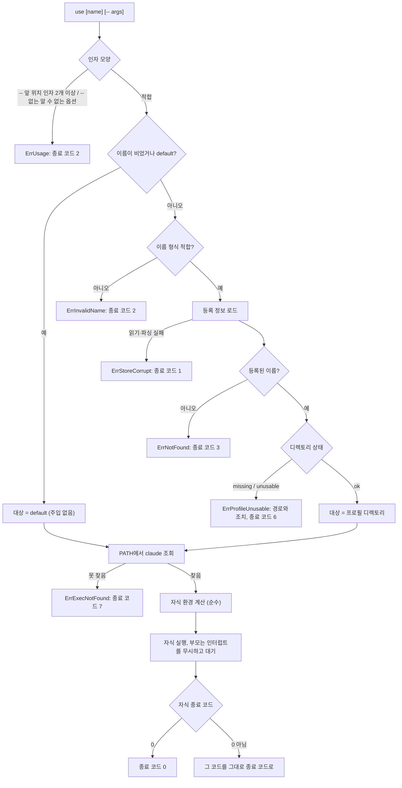

# profile-launcher — ANALYSIS

## 근거

읽은 문서

- `features/20260729-001-profile-launcher/spec.md` 전체 (§1 범위·입력 맥락, §2 목표, §3 제약
  9개, §4 제외 범위, §5 완료 조건 12개)
- 선행 feature `features/20260727-001-profile-store/`의 spec.md·analysis.md·implement.md —
  경계 분리(도메인·저장소 / CLI / 진입점), `Deps` 값 주입, sentinel error → 종료 코드 매핑,
  임시 디렉토리 위에서 실제 파일시스템을 쓰는 테스트 전략을 그대로 잇는다
- 루트 `README.md`, `ROADMAP.md` — M1 전환 기준, 최종 관문(플랫폼 분기와 순수 로직 분리,
  README와 실제 동작 일치), 명령 표면 표

저장소 탐색으로 확인한 사실

- 기존 코드는 `main.go`, `internal/cli`(cli.go, errors.go, add.go, list.go, rm.go),
  `internal/profile`(paths.go, name.go, store.go, create.go, status.go)이다. 새 의존성 없이
  `use`를 붙일 수 있고 `go.mod`에 추가할 것이 없다 — 필요한 것은 `os/exec`·`os/signal`이다.
- `internal/profile`이 이번 범위에 필요한 것을 이미 모두 노출한다 — `Layout.ProfileDir`,
  `ValidateName`, `Load`/`Store.Has`, `Inspect`/`Status`, `ErrNotFound`. 따라서 이 패키지에
  추가·수정이 없다.
- `cli.Deps`는 테스트에서 항상 필드 이름을 적은 리터럴로 만들어진다(add_test.go:17,
  list_test.go:28, rm_test.go:20). 필드를 늘려도 기존 테스트가 컴파일에서 깨지지 않는다.
- `cli.ExitCode`는 0~5만 쓰고 6 이상이 비어 있다. 매핑은 sentinel `errors.Is` 스위치 하나다.
- 루트 `README.md`는 `login`을 포함한 "사용 예시 (계획)" 블록과 `ACCOUNT`·`PLAN` 열이 있는
  `list` 출력 예시를 담고 있다. 실제 `list`는 `NAME`·`DIR`·`STATUS`를 낸다
  (internal/cli/list.go:41). `README.md`에 설치 절차 섹션은 없다.

의존성·표준 라이브러리 소스에서 확인한 사실

- pflag v1.0.10 `flag.go:1145-1150` — `--`를 만나면 플래그 파싱을 끝내고 남은 인자를 그대로
  위치 인자에 붙이며, 그 시점의 위치 인자 개수를 `ArgsLenAtDash()`로 남긴다. `--` 자신은
  버려지고 두 번째 `--`부터는 값으로 남는다.
- cobra v1.10.2 `command.go:688-690` — 서브커맨드를 찾는 `stripFlags`가 `--`에서 멈춘다.
  `--` 뒤의 값은 서브커맨드 이름으로 오인되지 않는다.
- `os/exec/lp_windows.go:126` — PATHEXT 기본값은 `.com;.exe;.bat;.cmd`다. `.ps1`은 없다.
- `os/exec/lp_windows.go:15-16,208` — 실행 파일을 못 찾으면 `exec.ErrNotFound`를 감싼
  `*exec.Error`가 돌아오므로 `errors.Is`로 판별할 수 있다.
- `os/exec/exec.go:541,590` — `Stdin`/`Stdout`/`Stderr`가 `*os.File`이면 파이프도 복사
  goroutine도 만들지 않고 그 핸들을 자식에게 그대로 넘긴다.
- `os/exec/exec.go:395-402` — Windows에서 `Args`는 `CommandLineToArgvW` 규약으로 인용되고,
  cmd.exe(따라서 모든 배치 파일)는 다른 규칙으로 되돌린다. 배치 파일을 실행 대상으로 잡으면
  인자 전달이 이 규약 차이에 걸린다.

main이 확인해 전달한 사실 (이 분석에서 재현하지 않았다)

- 툴체인은 `go1.26.5 windows/amd64`이고 `go test -count=1 ./...`가 통과한다.
- `syscall/exec_windows.go:453` — `Exec`는 `EWINDOWS`를 돌려준다. Windows에 exec 치환이 없다.
- 같은 파일 `:437` — `CreationFlags`를 직접 넣지 않으면 `CREATE_NEW_CONSOLE`이 붙지 않아
  자식이 부모 콘솔을 공유한다.
- 같은 파일 `:403-405` — 부모의 표준 핸들이 `StartupInfo`로 그대로 전달된다.
- 같은 콘솔에 붙은 프로세스는 `CTRL_C_EVENT`를 함께 받는다.
- Claude Code 2.1.220 기준: Windows 자격증명은 설정 디렉토리 안 `.credentials.json`이고,
  macOS는 `CLAUDE_CONFIG_DIR` 경로 문자열의 `sha256[:8]`을 Keychain 서비스 이름에 붙이며
  그 문자열을 정규화하지 않는다.
- 로컬 Windows 설치는 네이티브 `C:\Users\zipke\.local\bin\claude.exe`이며 npm shim이 아니다.
  다른 사용자 환경에서는 PATH가 `.cmd` shim을 가리킬 수 있다.

## 1. 구조

profile-store가 세운 세 경계(도메인·저장소 / CLI / 진입점)를 그대로 두고, 네 번째 경계로
**실행 경계**를 새로 만든다.

**실행 경계** — `internal/launch`. 자식 프로세스에 무엇을 넘길지 계산하는 순수 부분과, 실제로
프로세스를 띄워 기다리는 부분을 한 패키지 안에서 갈라 놓는다.

- 순수 부분은 부모 환경과 대상 설정 디렉토리를 받아 자식에게 줄 환경 전체를 돌려준다.
  파일시스템도, 프로세스도, `runtime.GOOS`도 보지 않는다. default 프로필에서 변수를 주입하지
  않고 제거하는 분기(SPEC §3)가 여기 들어간다.
- 실행 부분은 인터페이스 하나로 좁혀 둔다. 실행 파일을 PATH에서 찾는 일과, 확정된 명령·인자·
  환경으로 프로세스를 띄워 종료 코드가 나올 때까지 기다리는 일 둘만 갖는다. 부모 콘솔 인계와
  인터럽트 무시는 이 구현 안에만 있다. 테스트는 같은 인터페이스를 구현한 기록용 대역으로
  갈아끼워, 프로세스를 띄우지 않고 "어떤 경로에 어떤 인자와 어떤 환경을 넘겼는가"를 본다.

이 경계는 cobra도, 종료 코드도, 프로필 등록도 모르며 `internal/cli`를 참조하지 않는다.
플랫폼에 따라 갈리는 값은 `internal/profile`의 `Layout`이 경로에 대해 한 것과 같은 방식으로
값 하나에 모으고, 그 값을 만드는 생성자만 `runtime.GOOS`를 본다(D5).

**CLI 경계** — `internal/cli`에 `use` 커맨드가 붙는다. 실행 전 판정의 순서와 정책이 여기
있다. 이름을 어떻게 대상으로 옮기는지, 무엇을 거부하는지, 어떤 메시지와 종료 코드를 내는지가
CLI의 몫이고, 프로필의 존재·경로·상태 판정은 `internal/profile`에 그대로 묻는다.

**진입점** — `main.go`가 실제 구현(PATH 조회와 프로세스 실행), 플랫폼 값, `os.Environ()`을
`Deps`에 채워 넘긴다. 프로세스 종료를 아는 유일한 자리라는 성격은 그대로다.

`internal/profile`은 손대지 않는다. profile-store가 이 feature를 소비자로 두고 만든 계약이
그대로 쓰인다(SPEC §1).

## 2. 데이터 흐름

### 실행 경로



거부 경로 어디에서도 디렉토리를 만들거나 등록을 고치지 않으며 자식 프로세스도 뜨지 않는다.
`use`는 프로필 상태를 고치지 않는다는 SPEC §3의 제약이 이 흐름 전체에 걸린다 — 등록되어
있는데 디렉토리가 없으면 만들어 진행하는 대신 멈춘다(SPEC §5.8).

판정 순서는 임의가 아니다. 사용자가 방금 입력한 값(이름)에 대한 판정을 먼저 하고, 환경에 대한
판정(PATH 조회)을 나중에 한다. 반대로 두면 이름을 잘못 쓴 사용자에게 PATH 문제를 먼저 보여
주게 된다(D14).

### 인자와 대상 이름

`--` 앞은 ccswitch의 위치 인자이고 `--` 뒤는 손대지 않고 넘길 인자다. 이 구분은 직접 만들지
않고 파서가 남긴 정보를 읽는다 — pflag가 `--`에서 파싱을 끝내고 그 앞의 위치 인자 개수를
따로 기록하므로, 그 개수가 0이면 이름 생략, 1이면 그 값이 프로필 이름, 2 이상이면 사용법
오류다. `--` 뒤 값은 전부 그대로 자식의 인자가 된다(SPEC §5.3). `--` 없이 알 수 없는 옵션이
오면 파서가 먼저 거부하며, 그 오류는 기존 `ErrUsage` 분류를 타고 종료 코드 2가 된다
(SPEC §3). `use`에서는 이 경우 "claude에 줄 옵션은 `--` 뒤에 두라"는 한 줄을 함께 낸다.

이름이 비었거나 `default`면 같은 대상으로 본다(D12). 그 밖의 이름은 형식 검증 → 등록 확인 →
디렉토리 상태 확인을 거친다.

### 자식 환경 구성

부모 환경 전체를 받아 다음을 적용한 새 목록을 만든다. 순수 계산이며 파일시스템도 프로세스도
건드리지 않는다.

1. `CLAUDE_CONFIG_DIR`과 `CLAUDE_SECURESTORAGE_CONFIG_DIR`에 해당하는 항목을 모두 지운다.
   호출한 셸에 이 값이 남아 있어도 실행된 세션에 닿지 않는다(SPEC §5.10).
2. 대상이 이름 있는 프로필이면 `CLAUDE_CONFIG_DIR=<프로필 디렉토리>`를 붙인다. 대상이
   default면 아무것도 붙이지 않는다 — 기본 경로를 값으로 넣으면 Claude Code가 평소와 다른
   자격증명 항목과 다른 설정 파일 위치를 보게 된다(SPEC §3, §5.2).

주입하는 경로 문자열은 `Layout.ProfileDir(name)`이 돌려준 값 그대로다. 정규화하지 않고,
뒤에 구분자를 붙이지 않는다(D6). `list`가 보여주는 경로와 주입하는 경로가 같은 함수에서
나오므로 사용자가 본 것과 세션이 쓰는 것이 갈라지지 않는다.

환경 목록은 자식에게 항상 명시적으로 넘긴다. default 대상에서도 "부모 환경을 그대로 상속"
으로 두지 않는다 — 그러면 1의 제거가 사라진다.

작업 디렉토리는 넘기지 않는다. 자식이 부모의 현재 디렉토리를 그대로 물려받아야 Claude Code가
같은 프로젝트를 본다.

### 입출력, 인터럽트, 종료 코드

자식의 표준 입출력은 `Deps`의 스트림을 거치지 않고 실제 표준 입출력 파일을 직접 받는다
(D10). 파이프로 감싸면 TUI 판정이 비대화형으로 떨어지고, `Deps`의 스트림은 테스트에서 버퍼로
갈아끼우는 값이라 자식에게 줄 콘솔 핸들이 아니다. 새 콘솔 창을 요청하지 않으므로 자식은 부모
콘솔을 공유한다(SPEC §5.5).

같은 이유로 `use`는 성공 경로에서 자기 출력을 내지 않는다. `add`·`rm`은 결과 한 줄을 stderr에
남기지만, `use`가 그렇게 하면 화면이 `claude`를 직접 실행한 것과 달라진다(SPEC §5.5).

부모는 자식을 기다리는 동안 인터럽트를 무시하고, 자식이 끝난 뒤 원래대로 돌린다. Ctrl+C는 같은
콘솔의 두 프로세스가 함께 받으므로, 무시하지 않으면 부모가 먼저 사라져 자식이 남는다
(SPEC §5.6).

자식이 끝나면 그 종료 코드가 ccswitch의 종료 코드가 된다(SPEC §5.4). 0이면 성공으로 끝내고,
0이 아니면 그 코드만 나르는 error를 돌려 진입점의 매핑이 그대로 내보낸다. 이 경로에서는
ccswitch가 어떤 메시지도 덧붙이지 않는다 — Ctrl+C로 세션을 빠져나올 때마다 "Error: exit
status ..." 한 줄이 붙으면 SPEC §5.5의 "구별되지 않는다"가 깨진다.

## 3. 인터페이스

### CLI 표면

```
ccswitch use [name] [-- args...]
```

`--` 앞 위치 인자는 0개 또는 1개다. `--` 뒤는 개수 제한 없이 그대로 전달된다. `use`는 자기
플래그를 갖지 않는다.

```bash
ccswitch use              # default 설정 디렉토리로 실행
ccswitch use default      # 위와 같다
ccswitch use work         # work 프로필 디렉토리로 실행
ccswitch use work -- --model opus   # "--model opus"를 claude에 그대로 전달
```

### 실행 경계가 노출하는 계약

```go
// internal/launch

// Spec은 자식 프로세스에 넘길 것 전부다. 작업 디렉토리는 담지 않는다 — 자식은 부모의
// 현재 디렉토리를 그대로 물려받아야 한다.
type Spec struct {
    Path string   // PATH 조회로 확정된 실행 파일 경로
    Args []string // "--" 뒤에 온 인자. 실행 파일 이름은 포함하지 않는다
    Env  []string // 자식에게 줄 환경 전체. 상속에 맡기지 않고 항상 채운다
}

// Launcher는 프로세스 세계와의 유일한 접점이다. 테스트는 이 인터페이스를 기록용 대역으로
// 갈아끼운다.
type Launcher interface {
    // Lookup은 PATH에서 실행 파일을 찾는다. 못 찾으면 exec.ErrNotFound를 감싼 error다.
    Lookup(name string) (string, error)
    // Run은 자식이 끝날 때까지 기다린다. 자식이 끝났으면 그 종료 코드와 nil을 돌려주며,
    // 0이 아닌 코드도 error가 아니다. error는 띄우지 못했거나 기다릴 수 없었던 경우다.
    Run(Spec) (int, error)
}

// OSLauncher는 실제 구현이다. 실제 표준 입출력 핸들 인계와 인터럽트 무시를 소유한다.
type OSLauncher struct{}

// Platform은 플랫폼에 따라 갈리는 실행 환경 사실만 담는다. NewPlatform이 runtime.GOOS를
// 보는 유일한 자리이고, Environ은 이 값을 받아 어느 환경에서도 같게 돈다.
type Platform struct {
    EnvNamesCaseInsensitive bool
}
func NewPlatform() Platform

// Environ은 base에서 인증 관련 설정 디렉토리 변수를 지우고, configDir이 비어 있지 않으면
// CLAUDE_CONFIG_DIR을 그 값으로 붙인다. 빈 문자열은 default 대상을 뜻한다.
func (p Platform) Environ(base []string, configDir string) []string
```

### CLI 경계의 확장

`Deps`에 세 필드가 붙는다. 기존 필드와 성격이 같다 — 실행 환경에서 온 값을 진입점이 한 번
만들어 값으로 넘기고, 테스트가 같은 자리에 자기 값을 넣는다.

```go
type Deps struct {
    Layout      profile.Layout
    Stdin       io.Reader
    Stdout      io.Writer
    Stderr      io.Writer
    Interactive bool

    Platform launch.Platform  // 환경변수 이름 비교 정책
    BaseEnv  []string         // 부모 환경. main이 os.Environ()으로 채운다
    Launcher launch.Launcher  // PATH 조회와 프로세스 실행
}
```

`ExitCode`의 계약이 하나 늘어난다 — 자식이 0이 아닌 코드로 끝났다는 사실만 나르는 error를
sentinel 표보다 먼저 보고, 그 코드를 그대로 돌려준다.

### 종료 코드

profile-store가 정한 0~5는 그대로 두고 둘을 더한다. 6 이후를 이후 feature에 남기기로 한
약속에 따른 추가이며, 기존 코드의 뜻은 바뀌지 않는다.

| 코드 | 의미 |
|---|---|
| 6 | 등록된 프로필의 디렉토리를 쓸 수 없다 (없거나 디렉토리가 아니다) |
| 7 | PATH에서 Claude Code 실행 파일을 찾을 수 없다 |

여기에 더해, 자식이 실행된 뒤에는 그 종료 코드가 위 표와 무관하게 그대로 나간다(D7).

## 4. 영향 범위

`internal/profile`은 바뀌지 않는다. 이번 범위가 필요로 하는 계약(`Layout.ProfileDir`,
`ValidateName`, `Load`/`Store.Has`, `Inspect`, `ErrNotFound`)이 모두 이미 있음을 소스로
확인했다(§근거).

바뀌는 기존 파일은 셋이다.

- `internal/cli/cli.go` — `Deps`에 세 필드가 붙고 커맨드 트리에 `use`가 더해진다. `Deps`가
  기존 테스트·`main.go`에서 모두 필드 이름을 적은 리터럴로 만들어지므로 필드 추가로 컴파일이
  깨지는 자리는 없다(§근거).
- `internal/cli/errors.go` — `ExitCode`에 자식 종료 코드 분기와 새 sentinel 두 개의 분기가
  더해진다. 기존 0~5 매핑은 그대로다.
- `main.go` — 새 `Deps` 필드를 실제 구현·`runtime.GOOS` 기반 값·`os.Environ()`으로 채운다.

새로 생기는 것은 `internal/launch`(순수 환경 계산, `Launcher` 계약, 실제 구현)와
`internal/cli/use.go`, 그리고 각각의 테스트다. `go.mod`에 추가되는 의존성은 없다.

루트 `README.md`가 바뀐다(SPEC §5.12). 현재 상태 문구는 `use`가 없다고 적고 있고, 사용 예시
블록은 아직 없는 `login`을 포함하며, `list` 출력 예시가 실제 출력(`NAME`·`DIR`·`STATUS`)과
다른 열을 보여준다. 범위는 D17에서 확정한다.

`ROADMAP.md`는 바뀌지 않는다. 상태를 표시하는 자리가 없고, M1 전환 기준 자체가 이 feature의
완료 조건과 같은 내용이다.

## 5. Decision Points

### D1 — 프로세스 실행 경계와 테스트 대역

- 옵션 A: `use` 커맨드 안에서 `exec.LookPath`와 `exec.Command`를 직접 부른다. 대가: 코드가
  가장 짧지만, "어떤 환경과 인자를 넘겼는가"를 확인하려면 실제로 프로세스를 띄워야 한다.
  거부 경로 테스트도 PATH에 실제 실행 파일이 있는지에 따라 결과가 갈린다.
- 옵션 B: PATH를 임시 디렉토리로 바꾸고 가짜 `claude` 실행 파일을 놓아 실제로 띄운다.
  대가: 실제 동작에 가장 가깝지만 테스트가 프로세스 전역 환경변수를 건드려 병렬 실행에서
  간섭하고(profile-store D15가 같은 이유로 접은 방식), 플랫폼별 실행 파일을 테스트 안에서
  만들어야 한다.
- 옵션 C: PATH 조회와 프로세스 실행을 인터페이스 하나로 묶어 `Deps`로 주입한다. 테스트는
  넘겨받은 `Spec`을 기록하고 정해진 코드를 돌려주는 대역을 쓴다. 대가: 실제 구현은 이 경로로
  검증되지 않는다.
- 채택: C. 조회와 실행을 각각 다른 함수 값으로 두지 않고 인터페이스 하나로 묶는다.
- 근거: 이번 feature에서 정말 검증해야 하는 것은 "무슨 경로에 무슨 인자와 무슨 환경을
  넘겼는가"이고(SPEC §5.2, §5.3, §5.10), 그것은 프로세스를 띄우지 않아도 전부 확인된다.
  조회를 같은 경계에 두면 SPEC §5.9의 실패를 프로세스 전역 PATH를 건드리지 않고 구성할 수
  있고, 확정된 실행 파일 경로도 기록에 남아 함께 검증된다. 둘을 각각 함수 값으로 두면
  `Deps`에 필드가 둘 늘고 "프로세스 세계"라는 경계에 이름이 붙지 않는다. C가 남기는 빈틈
  (실제 구현 미검증)은 D16에서 왕복 테스트 하나로 좁힌다.

### D2 — exec 치환과 자식 프로세스 대기 중 어느 쪽을, 플랫폼마다 갈라야 하는지

- 옵션 A: 빌드 태그로 나눠 Unix는 `syscall.Exec`로 자기를 대체하고 Windows는 자식으로 띄운다.
  대가: 종료 코드 전달과 인터럽트 처리가 플랫폼마다 다른 두 동작이 되고, Windows에서는 Unix
  분기가 컴파일조차 되지 않아 깨진 것을 모른다(profile-store D6이 같은 이유로 접은 방식).
- 옵션 B: 모든 플랫폼에서 자식으로 띄우고 부모가 남아 기다린다. 대가: Unix에서도 부모
  프로세스가 하나 남고, `claude`가 셸의 손자 프로세스가 된다.
- 채택: B.
- 근거: Windows에는 exec 치환이 없으므로(§근거) Windows 동작은 어차피 B다. A를 고르면 M4에서
  검증해야 할 동작이 하나 더 늘고, 어느 환경에서도 테스트할 수 있어야 한다는 ROADMAP 최종
  관문과 어긋난다. B가 남기는 부모 프로세스의 비용은 대기 상태의 작은 상주 메모리뿐이며,
  사용자가 관찰하는 것(같은 창, 같은 화면, 같은 종료 코드)은 달라지지 않는다.
- 따라온 결과: 이 경계에 `runtime.GOOS` 분기가 없다. 새 콘솔을 요청하지 않고 표준 핸들을
  그대로 넘긴다는 판단은 "추가로 아무것도 하지 않는다"로 실현되므로, 플랫폼에 특이한 것은
  코드가 아니라 그렇게 두는 이유다. 그 이유는 코드 주석으로 남긴다.

### D3 — 환경 구성을 순수 계산으로 떼어낼지

- 옵션 A: 실행 직전에 `exec.Cmd.Env`를 채우며 그 자리에서 계산한다. 대가: 짧지만 SPEC §5.2·
  §5.10 검증이 프로세스 실행과 묶인다.
- 옵션 B: 부모 환경과 대상 디렉토리를 받아 자식 환경을 돌려주는 순수 함수로 떼어낸다.
  대가: 부모 환경을 값으로 주입할 자리가 `Deps`에 하나 더 필요하다.
- 채택: B. default 대상은 같은 함수에서 "붙이지 않는다"로 표현한다.
- 근거: 이번 feature의 정확성 대부분이 이 목록 하나에 들어 있다 — 무엇이 붙는지(SPEC §5.1),
  무엇이 붙지 않는지(SPEC §5.2), 호출한 셸의 값이 사라지는지(SPEC §5.10). 순수 함수면 이 셋이
  table-driven 테스트 하나로 닫히고, 부모 환경을 값으로 받으므로 프로세스 전역 환경변수를
  건드리지 않는다. 주입과 제거를 다른 함수로 나누지 않는 것은, 두 경우의 차이가 "붙이는
  단계가 있는지"뿐이고 제거는 양쪽에 공통이기 때문이다.

### D4 — 제거할 환경변수의 범위

- 옵션 A: SPEC §5.10이 이름을 댄 `CLAUDE_CONFIG_DIR`·`CLAUDE_SECURESTORAGE_CONFIG_DIR` 둘만
  지운다. 대가: 호출한 셸에 `ANTHROPIC_API_KEY` 같은 값이 남아 있으면 세션이 프로필의
  자격증명 대신 그 값으로 인증할 수 있다.
- 옵션 B: 인증에 영향을 주는 변수를 넓게 잡아 API 키·토큰·베이스 URL까지 지운다. 대가:
  의도적으로 API 키를 쓰는 사용자에게 ccswitch를 거치면 인증이 조용히 달라진다. 어디까지가
  인증 관련인지는 Claude Code의 비공식 동작에 달려 있어 목록이 계속 자란다.
- 채택: A. SPEC §3의 "인증 관련 환경변수"를 설정 디렉토리를 가리키는 두 변수로 읽는 것을
  사용자가 확인했다.
- 근거: SPEC §3이 제거를 요구하는 목적은 "호출한 셸의 설정이 프로필 격리를 깨지 않게" 하는
  것이다. 설정 디렉토리를 가리키는 두 변수만이 프로필 사이의 격리를 깬다 — 어느 프로필로
  실행해도 같은 자격증명·설정 파일을 보게 만든다. API 키류는 모든 프로필에 똑같이 작용하고
  `claude`를 직접 실행했을 때와도 결과가 같으므로, 프로필 사이를 갈라놓는 데 실패하지 않는다.
  B는 SPEC §5에 없는 동작을 넣으면서 기존 사용자의 인증을 조용히 바꾼다.
- 받아들이는 잔여 위험: API 키가 설정된 셸에서 실행하면 SPEC §5.11의 "두 계정이 다르게
  보고된다"가 성립하지 않는다. 이는 `claude`를 직접 실행해도 같으며 사용자 환경의 사실이다.

### D5 — 환경변수 이름 비교의 대소문자 정책

- 옵션 A: 항상 대소문자를 구분해 비교한다. 대가: Windows 환경변수 이름은 대소문자를 구분하지
  않으므로 셸이 `claude_config_dir`로 만들어 둔 값이 걸러지지 않는다. Claude Code는 그 값을
  읽으므로 SPEC §5.10이 깨지고, 증상은 "프로필을 지정했는데 다른 계정이 보인다"다.
- 옵션 B: 항상 대소문자를 무시해 비교한다. 대가: Unix에서 이름이 실제로 구분되므로,
  Claude Code가 읽지도 않는 소문자 이름 변수를 자식 환경에서 조용히 없앤다.
- 옵션 C: 정책을 값으로 받고, `runtime.GOOS`를 보는 생성자 한 곳에서만 정한다. 대가: 값을
  `Deps`로 흘려야 하고 순수 함수에 인자가 하나 늘어난다.
- 채택: C.
- 근거: A가 틀리는 방향은 격리 실패이고 심각도가 높다. B가 틀리는 방향은 무해에 가깝지만
  관련 없는 변수를 자식 환경에서 지우는 관찰 불가능한 변경이다. C는 두 플랫폼에서 각각 정확한
  동작을 만들면서, profile-store D6이 세운 원칙("플랫폼 의존은 생성자 한 곳, 나머지는 순수
  로직")을 그대로 따른다. 값으로 받으므로 Windows에서 Unix 정책을, Unix에서 Windows 정책을
  각각 테스트할 수 있어 ROADMAP 최종 관문의 요구와도 맞는다.

### D6 — 주입하는 경로 문자열을 정규화할지

- 옵션 A: 주입 전에 절대 경로화·`Clean`·심볼릭 링크 해석을 한다. 대가: 해석 결과가 실행
  시점의 파일시스템 상태와 현재 디렉토리에 달려 있어 같은 프로필이 실행마다 다른 문자열을
  받을 수 있다. macOS에서 그 문자열의 해시가 Keychain 항목을 가르므로, 문자열이 흔들리면
  같은 프로필이 다른 자격증명을 보고 사용자에게는 로그아웃된 것처럼 보인다.
- 옵션 B: `Layout.ProfileDir(name)`이 돌려준 값을 그대로 넣는다. 뒤 구분자를 붙이거나 떼는
  가공도 하지 않는다. 대가: 사용자 홈 경로의 표기가 바뀌면 주입 문자열도 바뀐다.
- 채택: B.
- 근거: SPEC §3이 "같은 프로필에 대해 주입하는 경로는 항상 같은 문자열"을 요구하고, 그 이유가
  정확히 정규화되지 않는 해시다(§근거). `ProfileDir`은 홈 루트와 검증된 이름만으로 계산되는
  순수 함수이므로 같은 입력에 같은 문자열을 낸다. B의 대가로 남는 것(홈 표기 변경)은 ccswitch
  밖의 사실이고, `list`가 보여주는 경로도 같이 바뀌므로 사용자가 보는 것과 세션이 쓰는 것이
  갈라지지 않는다.

### D7 — 자식 종료 코드 중계와 기존 종료 코드 표의 관계

- 옵션 A: 자식 코드를 ccswitch 코드 체계로 다시 매핑한다. 대가: SPEC §5.4를 정면으로 어긴다.
- 옵션 B: `use`가 종료 코드를 반환값으로 따로 돌려주고 진입점이 error와 함께 우선순위를
  판단한다. 대가: 같은 것을 나르는 통로가 둘이 되고, 진입점이 정책을 갖는다.
- 옵션 C: 0이 아닌 자식 종료 코드만 나르는 error 타입을 두고, 기존 매핑 함수가 sentinel
  표보다 먼저 그것을 본다. 대가: 이 error에는 사용자에게 보일 메시지가 없어야 하므로, `use`는
  프레임워크의 기본 오류 출력을 끄고 자기 실패 메시지를 직접 낸다 — 다른 세 커맨드와 출력
  경로가 달라진다.
- 채택: C.
- 근거: error 하나가 커맨드에서 종료 코드까지 가는 유일한 통로라는 기존 구조를 유지한다.
  B는 진입점을 얇게 두기로 한 profile-store의 배치를 되돌린다. C의 대가를 없애려면 네 커맨드
  전부의 오류 출력을 프레임워크에서 걷어내야 하는데, 그러면 stderr 내용을 보는 기존 테스트
  다섯 파일이 함께 흔들린다 — SPEC이 요구하지 않은 리팩터링이므로 변경을 `use` 안에 갇힌
  쪽을 택한다. 메시지 접두사는 다른 커맨드와 같게 맞춘다.
- 코드 표와의 관계: 2~7은 ccswitch가 실행을 거부했을 때만 쓰이고, 자식이 한 번 뜬 뒤에는
  자식의 코드가 그대로 나간다. 한 번의 실행에서 두 경우가 겹칠 수 없으므로 모순은 없다. 다만
  스크립트에서 "ccswitch가 거부한 3"과 "claude가 낸 3"은 코드만으로 구별되지 않는다. 구별이
  필요하면 거부 경로는 stderr에 메시지를 남기고 자식은 뜨지 않았다는 사실로 갈린다.
- 받아들이는 잔여 위험: Unix에서 자식이 시그널로 죽으면 종료 코드가 음수로 보고되어 프로세스
  종료 시 255가 된다. Windows 범위에서는 발생하지 않으며, 128+시그널 관례로 옮길지는 M4에서
  실기와 함께 볼 일이다.

### D8 — 새 종료 코드를 둘 것인지

- 옵션 A: 새 실패 원인을 모두 기존 1(그 밖의 실패)로 보낸다. 대가: 표가 늘지 않지만,
  "프로필 디렉토리가 없다"와 "claude가 설치되지 않았다"가 입출력 오류와 같은 코드가 된다.
- 옵션 B: 6과 7을 새로 정한다. 대가: 공개되는 순간 호환성 표면이 늘어난다.
- 채택: B. 6은 등록된 프로필의 디렉토리를 쓸 수 없는 경우(SPEC §5.8), 7은 PATH에서 실행
  파일을 찾을 수 없는 경우(SPEC §5.9)다. `missing`과 `unusable`은 메시지만 다르고 코드는
  같이 6이다.
- 근거: profile-store D12가 원인별 코드를 지금 정하는 쪽을 택하고 6 이후를 이후 feature에
  비워 두었다. 그 약속을 쓰는 첫 자리이며, 나중에 세분화하면 이미 스크립트를 쓴 사용자에게
  파괴적 변경이 된다. 두 원인은 사용자가 취할 조치가 서로 다르고(프로필을 다시 만들기 /
  Claude Code를 설치하거나 PATH를 고치기) 1의 정의("입출력 오류, 메타데이터 손상")와도 성격이
  다르다. `missing`과 `unusable`을 한 코드로 묶는 것은 둘 다 "이 프로필로는 실행할 수 없다"는
  같은 분류이고, 조치의 차이는 메시지가 나르기 때문이다.

### D9 — 인터럽트 처리를 어느 경계가 소유할지

- 옵션 A: 진입점이 실행 전에 인터럽트를 무시해 둔다. 대가: 진입점이 자식 프로세스의 수명을
  알아야 하고, `use`가 아닌 명령에서도 Ctrl+C 동작이 바뀐다.
- 옵션 B: `use` 커맨드가 무시를 걸고 실행 후 되돌린다. 대가: CLI 경계가 프로세스 시그널을
  알게 되어, 실행 경계에 프로세스 세계를 몰아 둔 D1의 이유와 어긋난다.
- 옵션 C: 실제 실행 구현이 자식을 띄우기 직전에 걸고 기다린 뒤 되돌린다. 대가: 이 동작은
  기록용 대역으로 갈아끼운 테스트에 나타나지 않아 자동 검증되지 않는다.
- 채택: C. 무시 대상은 인터럽트 하나로 한정한다.
- 근거: "자식을 띄워 끝까지 기다린다"의 일부이지 CLI 정책이 아니다. 무시가 걸려 있는 구간이
  자식의 수명과 정확히 같아야 하는데, 그 구간을 아는 것은 실행 구현뿐이다(SPEC §5.6). 종료
  시그널까지 무시하면 대기 중 ccswitch를 정상 수단으로 끝낼 수 없게 되므로 대상을 늘리지
  않는다 — 그 경우 자식이 남지만 SPEC이 다루는 경우가 아니다. 자동 검증되지 않는 부분은
  D16의 관찰 항목으로 넘긴다.

### D10 — 자식의 표준 입출력을 `Deps` 스트림에서 받지 않는 것

- 옵션 A: `Deps`의 스트림을 자식에게 그대로 준다. 대가: 기존 주입 관례와 겉보기로 일관되지만,
  테스트에서 그 값이 버퍼이므로 실제 실행에서도 파이프가 만들어질 길이 열린다. 파이프로
  감싸면 TUI 판정이 비대화형으로 떨어져 화면이 깨진다.
- 옵션 B: 자식에게는 실제 표준 입출력 파일을 준다. `Deps`의 스트림은 ccswitch 자기 메시지에만
  쓴다. 대가: 값 주입 관례에서 벗어나 보이고, 콘솔 인계가 자동 테스트에 나타나지 않는다.
- 채택: B. 실제 파일 핸들은 실행 구현이 직접 참조한다.
- 근거: `Deps`의 스트림은 "ccswitch가 사용자에게 무엇을 말했는가"를 테스트가 읽기 위한
  통로이고, 자식이 필요한 것은 콘솔 그 자체다. 두 요구가 같은 필드로 만족될 수 없다 — 하나가
  버퍼이면 다른 하나가 깨진다(SPEC §5.5). 표준 라이브러리는 `*os.File`을 그대로 주면 파이프도
  복사 goroutine도 만들지 않는다(§근거). 이 선택 때문에 `use`는 성공 경로에서 자기 출력을
  내지 않는 것이 자연스러워지고, 그것이 SPEC §5.5의 "직접 실행한 것과 구별되지 않는다"와
  같은 방향이다.

### D11 — `--` 전후 인자 처리를 직접 만들지, 파서에 맡길지

- 옵션 A: `use`에서 플래그 파싱을 끄고 원시 인자를 직접 훑어 `--`를 찾는다. 대가: `--help`도
  직접 처리해야 하고, "`--` 없는 알 수 없는 옵션 거부"(SPEC §3)를 직접 구현해야 한다.
- 옵션 B: 파서 기본 동작에 맡기고, 파서가 남긴 "`--` 앞 위치 인자 개수"만 읽어 이름과 전달
  인자를 가른다. 대가: 파서 내부 상태 하나에 기대게 된다.
- 채택: B. `--` 앞 위치 인자가 0개면 default, 1개면 그 값이 이름, 2개 이상이면 사용법 오류다.
- 근거: 필요한 두 동작이 이미 파서의 기본 동작이다 — `--`는 파싱을 끝내고 뒤를 그대로 넘기며,
  알 수 없는 옵션은 그 앞에서 거부되어 기존 `ErrUsage` 분류를 탄다(§근거). A는 SPEC §3이
  "POSIX 관례를 따른다"고 한 것을 손으로 다시 구현하는 일이고, profile-store D9가 cobra를
  택한 이유가 정확히 `use`의 이 지점이었다. 서브커맨드 탐색도 `--`에서 멈추므로 `--` 뒤의
  값이 명령 이름으로 오인되지 않는다.

### D12 — `default`를 실행 대상으로 어떻게 받을지

- 옵션 A: 이름 생략만 default로 보고, `use default`는 기존 이름 검증에 걸려 "예약된 이름"으로
  거부한다. 대가: `list`가 `default`를 하나의 행으로 보여주므로 사용자가 가장 자연스럽게
  입력할 형태가 예약 이름 오류로 거부된다. 종료 코드도 사용법 오류(2)가 되어 오해를 부른다.
- 옵션 B: 이름 생략과 `default`를 같은 대상으로 해석한다. 등록 확인과 디렉토리 상태 확인을
  거치지 않고 곧바로 "주입하지 않는" 경로로 간다. 대가: `use`가 이름 검증 함수를 그대로 부를
  수 없고 대상 해석 단계를 한 겹 갖는다.
- 채택: B. 사용자가 확인했다.
- 근거: `default`는 profile-store D3이 조회 시점에 합성하는 실재하는 항목으로 정의했고
  `list`에 그렇게 나온다. 사용자가 목록에서 본 이름을 그대로 입력했을 때 거부되는 것은 표면의
  불일치다. SPEC §5.2가 요구하는 것은 결과 환경에 `CLAUDE_CONFIG_DIR`이 남지 않는 것이지
  이름을 못 쓰게 하는 것이 아니며, 예약 이름 규칙은 `add`·`rm`이 기본 설정 디렉토리를 만들거나
  지우지 못하게 하려는 것이라 `use`에는 그 위험이 없다.
- 상태 검사를 하지 않는 이유: default 대상은 아무것도 주입하지 않으므로 Claude Code가 자기
  기본 경로를 스스로 정한다. Claude Code를 한 번도 쓰지 않은 머신에서 그 디렉토리는 아직 없고
  세션이 만들 것이므로, 없다는 사실이 실패가 아니다. SPEC §5.8이 거부를 요구하는 대상은
  "등록되어 있지만 디렉토리가 없는 프로필"이며 default는 등록 대상이 아니다.

### D13 — 등록된 프로필의 디렉토리가 성하지 않을 때

- 옵션 A: 디렉토리를 만들어 주고 진행한다. 대가: 사용자가 바로 쓸 수 있게 되지만 SPEC §3의
  "`use`는 프로필 상태를 고치지 않는다"를 어긴다. 자격증명이 사라진 프로필이 새 빈 프로필처럼
  조용히 되살아나, 사용자는 로그인이 풀린 이유를 알 수 없다.
- 옵션 B: 기존 `Inspect` 판정을 그대로 쓰고, `ok`가 아니면 경로와 조치를 알리며 거부한다.
  대가: 사용자가 손으로 회복해야 한다.
- 채택: B. `missing`과 `unusable`은 같은 코드(D8)에 서로 다른 조치를 담는다. `missing`에는
  등록을 지우고 다시 만드는 절차를, `unusable`에는 그 경로에 놓인 것을 치우라는 안내를 넣는다.
- 근거: SPEC §5.8이 디렉토리를 만들지 않을 것과, 경로와 사용자가 취할 수 있는 조치를 함께
  보일 것을 요구한다. 상태 판정을 새로 만들지 않고 `Inspect`를 쓰는 것은 profile-store D10이
  이 소비자를 예상해 둔 자리다 — `list`가 `missing`으로 보여준 것과 `use`가 거부하는 것이 같은
  판정이어야 사용자가 두 출력을 연결할 수 있다.

### D14 — 실행 전 판정의 순서

- 옵션 A: PATH 조회를 가장 먼저 한다. 대가: Claude Code가 설치되지 않은 환경에서는 어떤
  이름을 넣어도 같은 오류가 나와, 이름을 잘못 쓴 사용자가 그 사실을 알 수 없다.
- 옵션 B: 이름 형식 → 등록 여부 → 디렉토리 상태 → PATH 조회 순으로 본다. 대가: 등록도 안 된
  이름을 넣은 사용자는 PATH 문제를 나중에야 알게 된다.
- 채택: B.
- 근거: 앞선 판정은 사용자가 방금 입력한 값에 대한 것이고 뒤의 판정은 환경에 대한 것이다.
  사용자가 고칠 수 있는 것을 먼저 알려주는 순서가 낫다. 이 순서는 profile-store의 `add`·`rm`이
  세운 순서(검증이 파일시스템 접근보다 먼저)와 같은 방향이며, 어느 순서든 거부 경로에서
  자식이 뜨지 않고 상태가 바뀌지 않는다는 점은 같으므로(SPEC §5.7, §5.8, §5.9) 선택 기준은
  메시지의 유용성 하나다.

### D15 — PATH가 `.cmd`/`.bat` shim을 가리키는 환경

- 옵션 A: PATH 조회 결과를 그대로 실행 대상으로 쓴다. 대가: 배치 파일이 잡히면 인자 인용
  규약이 갈리고(§근거), cmd.exe가 한 겹 끼어 Ctrl+C가 "Terminate batch job (Y/N)?"으로
  바뀔 수 있다. 로컬에 그런 환경이 없어 확인할 수 없다.
- 옵션 B: 네이티브 실행 파일이 아니면 거부하고 설치 안내를 낸다. 대가: 확인되지 않은 추측으로
  npm 설치 사용자를 전부 막는다. 대부분의 사용에서는 동작할 수 있다.
- 옵션 C: `.exe`를 먼저 찾아보고 없을 때만 일반 조회로 넘어간다. 대가: 두 설치가 공존할 때만
  득이 있고, "PATH 조회 결과를 쓴다"는 SPEC §4의 문구를 넘어서는 규칙을 도구가 갖게 된다.
- 채택: A. 이번 범위에서 shim 환경의 동작은 검증하지 않고 보증하지 않는다.
- 근거: SPEC §4가 실행 파일 위치를 따로 지정하는 수단을 제외하면서 "PATH 조회 결과를 쓴다"고
  못 박았다. B는 확인하지 않은 고장을 근거로 사용자를 막는 것이고, C는 SPEC이 주지 않은
  선택 규칙을 도구에 넣는 것이다. 로컬 환경은 네이티브 실행 파일이므로(§근거) 이번 마일스톤의
  검증 대상에서 shim은 벗어나 있다.
- 받아들이는 잔여 위험: shim만 설치된 환경에서 SPEC §5.3과 §5.6이 성립하지 않을 수 있다.
  실제 보고가 생기면 푸는 수단은 실행 파일 경로를 지정하는 옵션이고, SPEC §4가 그것을 이미
  이후 범위로 미뤄 두었다.

### D16 — 자동 검증이 닿는 경계

- 옵션 A: 전부 자동 테스트로 닫으려 한다. 대가: 콘솔 창·TUI·두 계정 로그인은 자동화할 수
  없고, 흉내낸 테스트는 통과하면서 실제 고장을 놓친다.
- 옵션 B: 결정 계층만 대역으로 테스트하고 실제 실행 구현은 검증하지 않는다. 대가: 환경이
  실제로 자식에게 도달하는지, 종료 코드가 실제로 전달되는지가 어디서도 확인되지 않는다.
  이 feature에서 가장 미묘한 부분이 정확히 그 구현이다.
- 옵션 C: 결정 계층은 대역으로 테스트하고, 더해서 실제 프로세스 왕복을 한 번 검증한다. 테스트
  바이너리 자신을 자식으로 띄워, 자식이 받은 환경과 인자를 파일로 남기게 하고 자식의 0이 아닌
  종료 코드가 ccswitch의 종료 코드로 나오는지를 본다. 대가: 자식 프로세스를 쓰는 테스트 하나가
  늘고, 그 테스트도 콘솔·TUI·Ctrl+C는 덮지 못한다.
- 채택: C. 그리고 자동 검증 밖에 남는 것을 사용자 실기 관찰로 명시적으로 고정한다 — IMPLEMENT
  완료가 그 관찰을 포함한다는 것을 사용자가 확인했다.
- 근거: SPEC §5.5(새 창 없음, TUI 정상)·§5.6(Ctrl+C)·§5.11(두 계정)은 실제 콘솔과 실제 계정
  로그인을 요구하므로 자동화할 수 없고, SPEC §5.11 자신이 사용자 실기 확인으로 관찰한다고
  적고 있다. 그렇다고 실행 구현을 전부 미검증으로 두면 D1이 남긴 빈틈이 그대로 남는다. C는
  가장 값싼 왕복 하나로 "환경 주입과 종료 코드 중계가 실제로 동작한다"를 닫는다.
- 자동으로 닫히는 것: `--` 뒤 인자가 그대로 전달됨(SPEC §5.3), 이름 있는 프로필에
  `CLAUDE_CONFIG_DIR`이 `Layout.ProfileDir` 값과 같은 문자열로 주입됨(SPEC §5.1의 주입
  부분), default에서 그 변수가 환경에 없음(SPEC §5.2), 호출 환경에 두 변수가 이미 있어도
  결과에 남지 않음(SPEC §5.10), 미등록·상태 불량·PATH 조회 실패의 메시지와 종료 코드와
  무부작용(SPEC §5.7, §5.8, §5.9), 자식 종료 코드가 그대로 나감(SPEC §5.4).
- 실기 관찰로 남는 것: 세션이 실제로 그 디렉토리에 기록을 쌓는지(SPEC §5.1의 관찰 부분),
  새 창이 뜨지 않고 TUI가 정상인지(SPEC §5.5), Ctrl+C에서 부모가 먼저 끝나지 않는지
  (SPEC §5.6), 두 계정이 서로 다르게 보고되는지(SPEC §5.11).

### D17 — README를 어디까지 고칠지

- 옵션 A: 상태 문구만 고친다. 대가: 사용 예시 블록이 `login`과 계정 정보가 붙은 `list` 출력을
  계속 보여주어, 아직 없는 것을 쓸 수 있는 것처럼 읽힌다.
- 옵션 B: 상태 문구를 고치고, 사용 예시를 지금 동작하는 명령만으로 다시 쓰고, `list` 출력
  예시를 실제 열로 바꾸고, 계획된 명령은 ROADMAP 링크로 미룬다. 대가: README 손질 범위가
  넓어진다.
- 채택: B. 첫 로그인을 Claude Code 세션 안에서 한다는 절차도 함께 적는다. 설치 안내는 넣지
  않는다.
- 근거: SPEC §5.12가 상태 문구와 사용 절차의 일치, 그리고 없는 명령을 쓸 수 있는 것처럼 적지
  않을 것을 함께 요구한다. `use`가 동작하기 시작하면 "(계획)"이라는 한 단어로 묶여 있던
  블록이 반은 사실이고 반은 계획인 상태가 되어, 어느 쪽으로도 정확하지 않다. 계획 명령의
  단일 기준은 ROADMAP의 명령 표면 표이므로 README가 그것을 중복해 들고 있을 이유가 없다.
  설치 안내를 넣지 않는 것은 SPEC §5가 요구하지 않기 때문이고, `go install` 안내는 ROADMAP
  최종 관문 항목으로 남는다.
