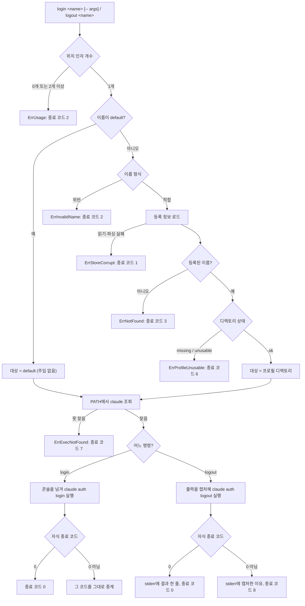
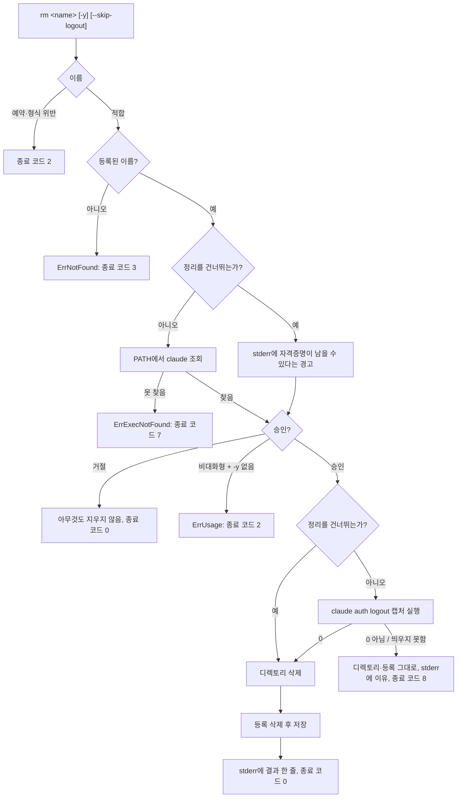

# profile-auth — ANALYSIS

## 근거

읽은 문서

- `features/20260730-001-profile-auth/spec.md` 전체 (§1 범위·입력 맥락, §2 목표, §3 제약 10개,
  §4 제외 범위, §5 완료 조건 11개)
- 선행 feature `features/20260729-001-profile-launcher/analysis.md` 전체 — 실행 경계 도입,
  `Launcher` 계약, 순수 환경 계산, 자식 종료 코드 중계(D7), 새 종료 코드 부여(D8), 판정
  순서(D14), 대상 해석에서 `default`를 이름으로 받는 것(D12)을 그대로 잇는다
- `features/20260727-001-profile-store/analysis.md` §3 — 종료 코드 0~5 표와 "6 이후는 다음
  feature들이 쓰도록 비워 둔다"는 약속
- 루트 `README.md`, `ROADMAP.md` — M2 전환 기준, 명령 표면 표, 최종 관문

저장소에서 확인한 사실

- `internal/cli`는 `cli.go`(트리 구성·`Deps`·인자 개수 래퍼), `errors.go`(sentinel과 `ExitCode`),
  `add.go`·`list.go`·`rm.go`·`use.go`다. 커맨드마다 `newXCommand(deps)`를 `NewRootCommand`가
  `AddCommand`로 붙이는 한 가지 모양이다.
- `ExitCode`는 0~7을 쓰고 8 이상이 비어 있다. 매핑은 sentinel `errors.Is` 스위치 하나이고,
  `childExitError`를 그 표보다 먼저 본다.
- 서브커맨드의 플래그 오류도 루트의 `SetFlagErrorFunc`를 타고 `ErrUsage` → 코드 2가 된다.
  `usage_test.go`의 `add -abc` 케이스가 이 경로를 이미 고정하고 있다.
- `rm`은 `cmd.Flags().BoolVarP(&yes, "yes", "y", ...)`로 플래그를 붙인다. 이 저장소에 있는
  유일한 플래그 선례다.
- `rm`의 현재 순서는 `ValidateName` → `Load` → `Has` → (프롬프트) → `os.RemoveAll` →
  `store.Remove` → `Save` → stderr 한 줄이다. `profile.Inspect` 판정을 거치지 않으므로
  `missing`·`unusable` 상태에서도 그대로 진행된다.
- `use.go`의 `useTargetDir`는 이름 → `default` 분기 → `ValidateName` → 등록 확인 →
  `profile.Inspect` 순으로 대상 디렉토리를 정하고, `default`와 이름 생략에는 빈 문자열을
  돌려준다. `claudeExecutable = "claude"` 상수와 `positionalCount`/`splitUseArgs`도 이 파일에 있다.
- `list.go`는 `default` 행을 합성해 맨 위에 두고 `tabwriter`로 `NAME`·`DIR`·`STATUS` 세 열을
  stdout에 낸다. `Launcher`를 쓰지 않으며, `list_test.go`의 `runCommand`는 `Deps.Launcher`를
  채우지 않은 채(nil) 커맨드 트리를 만든다.
- `launch.Launcher`는 `Lookup`·`Run` 두 메서드다. `Run`은 `os.Stdin/Stdout/Stderr`를 그대로
  자식에게 주고 `signal.Ignore(os.Interrupt)`를 건다. `Spec`은 `Path`·`Args`·`Env`뿐이고
  `Args` 주석은 "사용자가 `--` 뒤에 준 인자"로 좁게 적혀 있다.
- `launch.Platform.Environ(base, configDir)`이 `CLAUDE_CONFIG_DIR`·
  `CLAUDE_SECURESTORAGE_CONFIG_DIR`을 지우고 `configDir`이 비어 있지 않을 때만 붙인다.
  Windows에서는 이름 비교가 대소문자를 무시한다.
- `internal/profile`은 이번 범위가 필요한 것을 이미 다 노출한다 — `Layout.ProfileDir`,
  `DefaultDir`, `ValidateName`, `Load`/`Store.Has`/`Remove`/`Save`, `Inspect`/`Status`,
  `DefaultName`, sentinel 5개.
- `Launcher`를 구현한 테스트 대역은 셋이다 — `use_test.go`의 `recordingLauncher`,
  `use_lookup_test.go`의 `notFoundLauncher`(`recordingLauncher`를 embed),
  `use_roundtrip_test.go`의 `realRunLauncher`(독립 struct). 인터페이스에 메서드가 늘면
  `recordingLauncher`와 `realRunLauncher`가 컴파일에서 깨진다.
- `use_roundtrip_test.go`가 테스트 바이너리 자신을 자식으로 띄우는 왕복 검증 틀을 이미 갖고
  있다 — `TestMain`이 환경변수로 자식 모드를 가려내고, 자식이 받은 인자·환경을 파일로 남긴다.
- `go.mod`에 추가할 것이 없다. 필요한 것은 `encoding/json`과 이미 쓰는 `os/exec`다.
- 루트 `README.md`의 상태 블록은 "`add`·`list`·`use`·`rm`까지 동작한다 … 로그인은 아직 그 세션
  안에서 직접 하고, `list`는 이름·경로·상태만 보여준다"이고, 본문에 "로그인은 ccswitch가 다루지
  않는다" 단락이 있다. 이 변경 뒤 두 서술이 사실과 달라진다.

Claude Code 2.1.220 (Windows) 실기로 확인한 사실

- `claude auth`의 하위 명령은 `login`·`logout`·`status`다. `login`은 `--claudeai`(기본)·
  `--console`·`--email <email>`·`--sso`, `logout`은 옵션이 없고, `status`는 `--json`(기본)·
  `--text`를 갖는다.
- `claude auth status`는 JSON을 stdout에만 쓰고 stderr에는 아무것도 쓰지 않는다. 로그인 상태에서
  7개 필드(`loggedIn`, `authMethod`, `apiProvider`, `email`, `orgId`, `orgName`,
  `subscriptionType`)를 내고 종료 코드 0이다.
- 로그인되지 않은 설정 디렉토리에서 `claude auth status`는 `{"loggedIn": false,
  "authMethod": "none", "apiProvider": "firstParty"}`만 내고 종료 코드 1이다. 계정 식별 필드는
  아예 없다. 즉 종료 코드만으로는 "로그인 안 됨"과 "조회 실패"가 구별되지 않는다.
- `orgName` 값에는 공백이 들어간다(관찰값 "트립토파즈 - 기획 & 개발"). `email`과
  `subscriptionType`("team")에는 공백이 없다.
- `claude auth logout`은 로그인되지 않은 설정 디렉토리에서도 stdout에 "Successfully logged out
  from your Anthropic account."를 내고 종료 코드 0으로 끝난다. 설정 디렉토리가 없을 때도, 그
  자리에 일반 파일이 놓여 있을 때도 같다. stdin을 닫아 주어도 아무것도 묻지 않는다.
- `claude auth status`와 `claude auth logout`은 `CLAUDE_CONFIG_DIR`이 가리키는 디렉토리가 없으면
  그 디렉토리를 만들고 안에 `.claude.json`과 `backups/`를 남긴다.
- `CLAUDE_CONFIG_DIR`을 임시 디렉토리로 준 `logout`을 실행한 뒤에도 기본 설정 디렉토리의
  `claude auth status`는 그대로 로그인 상태였다 — 주입만으로 인증 조작이 갈린다.

추정 (실기로 확인하지 않았다)

- `claude auth login`은 브라우저 OAuth를 거치므로 사용자 상호작용이 필요하고, 실행 중 터미널을
  써서 안내나 코드 입력을 주고받을 수 있다. 실행하면 브라우저가 열리고 실제 인증이 일어나므로
  이 분석에서 돌리지 않았다. 근거는 SPEC §3·§1 입력 맥락과 README의 주의 항목이다.
- `--console` 인증에서 `email`이 비어 있고 다른 필드가 채워지는 형태가 나올 수 있다. `--console`
  로그인을 하지 않았으므로 그 JSON 모양은 관찰하지 못했다.

## 1. 구조

profile-store의 세 경계(도메인·저장소 / CLI / 진입점)와 profile-launcher의 실행 경계를 그대로
두고, 다섯 번째 경계로 인증 위임 경계를 새로 만든다.

인증 위임 경계 — `internal/auth`. `claude auth` 표면에 대한 단일 기준을 소유한다. 어떤 하위
명령과 어떤 옵션으로 부르는지, `status`가 돌려준 출력을 어떻게 읽는지, 그리고 그 출력이 답인지
실패인지 가르는 규칙이 여기 있다. 프로세스를 직접 띄우지 않고 이미 실행이 끝난 결과(stdout,
stderr, 종료 코드)를 값으로 받아 판정하므로 순수하다. cobra도, 종료 코드 표도, 프로필 등록도
모르고 `internal/cli`·`internal/launch`를 참조하지 않는다.

이 경계를 따로 두는 이유는 판정 규칙 하나가 직관과 반대라는 데 있다 — `claude auth status`는
로그인되지 않았을 때도 종료 코드 1을 낸다(§근거). 이 사실을 CLI 안에 흩어 두면 다음 사람이
"종료 코드가 1인데 성공으로 처리한다"를 결함으로 보고 되돌린다. 이름 붙은 경계 한 곳에 두면 그
규칙이 왜 그런지가 한 자리에서 읽힌다(SPEC §5.5, §5.11).

실행 경계 — `internal/launch`에 캡처 실행이 하나 더 붙는다. 지금 있는 실행은 자식에게 실제
콘솔을 그대로 넘기는 것 하나뿐이라(profile-launcher D10) 자식이 stdout에 낸 JSON을 읽을 길이
없다. 프로세스 세계와의 접점을 인터페이스 하나로 모아 둔 배치(profile-launcher D1)는 그대로
두고, 그 인터페이스에 "띄워서 출력을 받아 온다"를 더한다(D2).

CLI 경계 — `internal/cli`에 `login`·`logout` 두 커맨드가 붙고, `list`에 계정 조회 옵션이,
`rm`에 정리 위임과 건너뛰기 옵션이 붙는다. 대상 해석·거부 정책·메시지·종료 코드는 여기 그대로
남는다. `use`가 쓰던 대상 해석(이름 → `default` 분기 → 형식 검증 → 등록 확인 → 디렉토리 상태)은
`login`·`logout`이 `use`와 같은 내용으로 거부해야 하므로(SPEC §5.4) 네 커맨드가 함께 쓰는 자리로
옮긴다. 판정 자체는 바뀌지 않는다.

진입점 — `main.go`는 바뀌지 않는다. `Deps`에 새 필드가 생기지 않고, `launch.OSLauncher{}`가 새
메서드를 갖게 되면 그대로 계약을 만족한다.

`internal/profile`은 손대지 않는다. 이번 범위가 필요한 계약이 모두 이미 있다(§근거).

## 2. 데이터 흐름

### 공통 앞단 — 대상 해석과 실행 파일 조회

`login`·`logout`은 `use`와 같은 앞단을 지난다. 이름 형식 → 등록 여부 → 디렉토리 상태 → PATH
조회 순이며, 사용자가 방금 입력한 값에 대한 판정이 환경에 대한 판정보다 앞이다
(profile-launcher D14). 대상이 `default`면 등록 확인도 상태 확인도 거치지 않고 곧바로
"주입하지 않는" 경로로 간다(profile-launcher D12). 자식 환경은 `Platform.Environ`이 계산한
그대로다 — 설정 디렉토리를 가리키는 두 변수를 지우고, 이름 있는 프로필이면 `CLAUDE_CONFIG_DIR`을
`Layout.ProfileDir(name)`이 돌려준 문자열 그대로 붙인다. 이름 있는 프로필에 `login`·`logout`을
걸어도 기본 설정 디렉토리와 다른 프로필이 그대로인 것은 이 주입과 제거에서 나온다(SPEC §5.3).



거부 경로 어디에서도 디렉토리를 만들거나 등록을 고치지 않으며 자식 프로세스도 뜨지 않는다
(SPEC §5.4).

### login — 콘솔을 그대로 넘긴다

`login`은 `use`와 같은 실행을 쓴다. 실제 표준 입출력 파일을 자식에게 그대로 주고, 대기 중
인터럽트를 무시하고, 자식이 끝나면 그 종료 코드를 그대로 중계한다. 자식에게 주는 인자는
`auth login` 뒤에 사용자가 `--` 뒤에 준 값을 붙인 것이다.

`login`이 캡처가 아니라 콘솔 인계여야 하는 이유는 이 명령이 브라우저 OAuth를 거치기 때문이다
(SPEC §3). 절차 안내와 사용자 입력이 그 콘솔에서 오가야 하고, 출력을 파이프로 감싸면
profile-launcher D10이 막으려 한 것과 같은 고장(대화형 판정이 떨어지는 것)이 여기서도 일어난다.
ccswitch는 성공 경로에서 자기 출력을 내지 않는다 — 화면에 남는 것은 Claude Code가 낸 것뿐이다.

"대화형 세션을 띄우지 않는다"는 SPEC §5.1의 요구는 여기서 깨지지 않는다. 띄우지 않는 것은
Claude Code의 대화형 코딩 세션이고, `claude auth login`은 인증 절차만 밟고 끝나는 별개의 하위
명령이다.

### logout — 출력을 캡처한다

`logout`은 캡처 실행을 쓴다. 자식에게 콘솔을 주지 않고, 빈 표준 입력을 주고, 인터럽트 무시도
걸지 않는다. 끝난 뒤 stdout·stderr·종료 코드를 값으로 받아 인증 위임 경계가 판정한다 — 0이면
성공이고, 0이 아니면 캡처한 출력을 실패 이유로 나른다.

캡처를 고른 이유는 Claude Code가 로그아웃 성공 시 stdout에 내는 한 줄이 어느 프로필인지 말하지
않기 때문이다(§근거). 그 줄을 그대로 흘리면 프로필 셋을 오가는 사용자가 무엇이 로그아웃됐는지
알 수 없다. ccswitch는 대신 `add`·`rm`과 같은 자리(stderr 한 줄)에 프로필 이름을 담은 결과를
남긴다. 이어서 조회한 인증 상태가 로그인되지 않은 것으로 나오는 것(SPEC §5.2)은 Claude Code가
같은 설정 디렉토리를 보기 때문에 성립하며, ccswitch가 자격증명을 직접 지우는 단계는 없다.

### rm — 삭제 전 정리 위임

`rm`의 기존 순서 앞에 정리 위임이 들어간다. 순서는 다음과 같고, 각 자리가 왜 그 위치인지가
정확성에 걸린다.

1. 이름 형식·예약 이름 거부 — 지금과 같다. `default`는 여기서 걸리므로 정리 위임에 닿지 않는다.
2. 등록 정보 로드와 등록 여부 확인 — 지금과 같다. 등록되지 않은 이름은 아무것도 지우지 않고
   `ErrNotFound`로 끝난다.
3. 정리를 건너뛰지 않는 경우에만 PATH에서 `claude`를 조회한다. 확인 프롬프트보다 앞이다 —
   실행할 수 없는 정리를 두고 사용자에게 삭제 승인을 받는 것은 승인의 뜻을 바꾼다.
4. 확인 프롬프트. 지금과 같이 대화형이 아니면서 `--yes`가 없으면 `ErrUsage`로 끝난다.
5. 정리 위임. 캡처 실행으로 `claude auth logout`을 프로필 디렉토리에 대해 부른다. 실패하면
   여기서 멈춘다 — 디렉토리도 등록도 건드리지 않는다(SPEC §5.8).
6. `os.RemoveAll` → `store.Remove` → `store.Save` → stderr 한 줄. 지금과 같다.

프롬프트가 정리보다 앞인 것은 정리 자체가 되돌리기 어려운 상태 변경이라서다. 로그아웃한 뒤
사용자가 삭제를 거절하면, 취소했는데 계정이 풀린 프로필이 남는다.

정리 위임 앞에 디렉토리 상태 판정을 두지 않는다. `claude auth logout`은 설정 디렉토리가 없어도,
그 자리에 파일이 놓여 있어도 종료 코드 0으로 끝난다(§근거). 그리고 macOS에서 자격증명은 설정
디렉토리 밖 Keychain에 있으므로, 디렉토리가 이미 사라진 프로필에도 정리를 걸어야 잔여물이
없어진다 — 그것이 SPEC §5.7이 위임을 요구하는 목적이다. 위임이 없는 디렉토리를 만들어 두더라도
바로 뒤 `os.RemoveAll`이 그것까지 지운다.



로그인되지 않은 프로필의 삭제가 막히지 않는 것(SPEC §5.10)은 ccswitch가 미리 로그인 여부를 묻지
않기 때문이다. `claude auth logout`이 로그인되지 않은 설정 디렉토리에서도 종료 코드 0으로
끝나므로(§근거) 그 멱등성이 그대로 조건을 만족한다(D10).

### list — 옵션이 있을 때만 계정을 조회한다

옵션이 없으면 `list`는 지금과 완전히 같다. 등록 정보를 읽고 `default` 행을 합성해 맨 위에 두고
세 열을 낸다. 실행 경계에는 조회도 실행도 한 번 닿지 않는다(SPEC §5.6).

옵션이 있으면 표 앞단은 그대로 두고 다음이 더해진다.

1. PATH에서 `claude`를 한 번 조회한다. 실패하면 표를 내지 않고 `use`와 같은 메시지로 코드 7이
   된다. 프로필마다 다시 조회하지 않는다.
2. 행마다 `profile.Inspect` 결과가 `ok`인 경우에만 캡처 실행으로 `claude auth status --json`을
   부른다. 조회는 행 순서대로 하나씩 한다(D8).
3. `ok`가 아닌 행은 조회하지 않는다. `claude auth status`가 없는 설정 디렉토리를 만들어 버리기
   때문이다(§근거) — 조회했다면 `missing` 프로필이 목록을 본 것만으로 `ok`로 바뀌고, 기본 설정
   디렉토리를 한 번도 쓰지 않은 머신에서는 `list`가 `~/.claude`를 만든다. 어느 상태도 고쳐 쓰지
   않는다는 기존 판정(profile-launcher D13, D12)이 여기서도 그대로 걸린다(D7).
4. 조회 결과는 인증 위임 경계가 판정한다. stdout이 `loggedIn`을 담은 JSON 객체로 읽히면 종료
   코드가 무엇이든 그것이 답이고, 그렇지 않으면 조회 실패다(D4).

행마다 계정 열에 들어가는 값은 네 갈래다 — 로그인된 프로필은 계정 식별 값, 로그인되지 않은
프로필은 그것을 가리키는 표기, 조회가 실패한 프로필은 또 다른 표기, 조회하지 않은 행은 빈 값
표기다. 네 갈래가 서로 구별된다는 것이 SPEC §5.5가 요구하는 것이다. 조회 실패는 행마다 stderr에
한 줄을 남기고 전체 종료 코드를 8로 만들지만 표 자체는 그대로 나간다(SPEC §5.11) — 프로필 하나의
조회가 실패했다고 나머지 정보를 감출 이유가 없다. 로그인되지 않음과 조회하지 않음은 실패가
아니므로 종료 코드에 영향을 주지 않는다.

### 실패 표시와 종료 코드의 갈림

이 feature가 더하는 실패 경로는 모두 stderr에 무엇이 실패했는지와 조치를 담은 한 줄을 남기고 0이
아닌 코드로 끝난다(SPEC §5.11). 어느 코드가 나가는지는 누가 사용자에게 말했는지로 갈린다.

- 콘솔을 자식에게 넘긴 실행(`use`, `login`)은 자식이 이미 화면에 말했으므로 ccswitch가 아무것도
  덧붙이지 않고 자식의 종료 코드를 그대로 중계한다(profile-launcher D7).
- 출력을 캡처한 실행(`logout`, `rm`의 정리, 계정 조회)은 자식이 사용자에게 말할 수 없었으므로
  ccswitch가 캡처한 내용을 stderr에 옮기고 자기 코드(8)를 낸다.

## 3. 인터페이스

### CLI 표면

```
ccswitch login <name> [-- args...]
ccswitch logout <name>
ccswitch list [--accounts]
ccswitch rm <name> [-y] [--skip-logout]
```

`login`·`logout`은 대상 이름을 반드시 받는다. `default`도 이름으로 받으며 `use`와 같게 주입 없이
기본 설정 디렉토리를 가리킨다. `login`의 `--` 뒤 값은 해석하지 않고 `claude auth login`에 그대로
넘어간다. `logout`은 `--` 뒤 전달을 받지 않는다 — `claude auth logout`에 옵션이 없다(§근거).

```bash
ccswitch login work                 # work 프로필로 로그인 절차를 시작한다
ccswitch login work -- --console    # "--console"을 claude auth login에 그대로 전달
ccswitch logout work
ccswitch list --accounts
ccswitch rm work                    # 삭제 전 자격증명 정리를 위임한다
ccswitch rm work --skip-logout      # 정리를 건너뛴다. 자격증명이 남을 수 있다
```

`list --accounts`는 기존 세 열 뒤에 계정 열과 플랜 열을 더한다.

```
NAME     DIR                         STATUS    ACCOUNT           PLAN
default  C:\Users\you\.claude        ok        you@example.com   team
work     C:\Users\you\.claude-work   ok        work@example.com  max
spare    C:\Users\you\.claude-spare  ok        logged-out        -
broken   C:\Users\you\.claude-broken ok        unknown           -
gone     C:\Users\you\.claude-gone   missing   -                 -
```

옵션이 없을 때의 출력은 이 feature 전후로 헤더와 행이 그대로다(SPEC §5.6).

### 인증 위임 경계가 노출하는 계약

```go
// internal/auth

// Status는 claude auth status가 보고한 인증 상태다. 로그인되지 않은 상태에서는 계정 식별
// 필드가 비어 있다 — Claude Code가 그 필드를 아예 내지 않는다.
type Status struct {
    LoggedIn         bool
    AuthMethod       string
    APIProvider      string
    Email            string
    OrgID            string
    OrgName          string
    SubscriptionType string
}

// LoginArgs·LogoutArgs·StatusArgs는 claude에 넘길 인자를 만든다. 하위 명령 이름과 옵션을
// 아는 유일한 자리다. StatusArgs는 --json을 명시한다 — 지금은 기본값이지만 기본값이 바뀌면
// 파싱이 조용히 깨진다.
func LoginArgs(forwarded []string) []string
func LogoutArgs() []string
func StatusArgs() []string

// ReadStatus는 끝난 claude auth status의 결과를 읽는다. stdout이 loggedIn을 담은 JSON
// 객체로 읽히면 종료 코드가 무엇이든 그것이 답이다 — Claude Code는 로그인되지 않은 상태를
// 종료 코드 1로 보고한다. 그렇게 읽히지 않으면 조회가 실패한 것으로 보고, 캡처한 출력과
// 종료 코드를 담은 error를 돌려준다.
func ReadStatus(stdout, stderr string, exitCode int) (Status, error)

// ReadLogout은 끝난 claude auth logout의 결과를 읽는다. 0이면 성공이고, 0이 아니면 캡처한
// 출력을 실패 이유로 담은 error를 돌려준다.
func ReadLogout(stdout, stderr string, exitCode int) error
```

이 경계는 `internal/launch`·`internal/cli`를 참조하지 않는다. 종료 코드 표도 출력 형식도 모른다.

### 실행 경계의 확장

```go
// internal/launch

// Captured는 출력을 받아 온 실행의 결과다. 0이 아닌 종료 코드는 error가 아니다 — Run과 같은
// 규칙이며, claude auth status가 로그인되지 않은 상태를 1로 보고하기 때문에 특히 그렇다.
type Captured struct {
    ExitCode int
    Stdout   string
    Stderr   string
}

type Launcher interface {
    Lookup(name string) (string, error)
    Run(spec Spec) (int, error)
    // Capture는 자식을 띄워 끝날 때까지 기다리고 표준 출력·표준 오류를 값으로 받아 온다.
    // 부모 콘솔을 자식에게 넘기지 않고, 자식의 표준 입력은 비어 있다 — 무언가를 묻는 자식이
    // 입력을 기다리며 멈추지 않게 한다. 인터럽트 무시를 걸지 않으므로 Ctrl+C가 둘을 함께
    // 끝낸다.
    Capture(spec Spec) (Captured, error)
}
```

`Spec.Args`의 뜻이 넓어진다 — 지금은 사용자가 `--` 뒤에 준 인자만 담지만, 앞으로는 ccswitch가
정한 하위 명령(`auth login` 등)이 앞에 붙은 전체 인자 목록이다. `Spec`·`Platform`·`Environ`의
나머지 계약은 그대로다.

`Deps`에는 새 필드가 생기지 않는다. 캡처 실행이 기존 `Launcher` 필드 안으로 들어가기 때문이다.

### 종료 코드

profile-store가 정한 0~5와 profile-launcher가 더한 6~7은 뜻이 그대로다. 하나를 더한다.

| 코드 | 의미 |
|---|---|
| 8 | Claude Code에 위임한 `claude auth` 명령이 답을 주지 못했다 |

8이 나가는 자리는 셋이다 — `logout` 실패, `rm`의 정리 실패, 계정 조회 실패. 9 이후는 이후
feature에 비워 둔다. `login`은 자식이 한 번 뜬 뒤에는 profile-launcher D7의 중계 규칙을 그대로
타므로 이 표를 거치지 않는다.

## 4. 영향 범위

`internal/profile`은 바뀌지 않는다. 이번 범위가 필요한 계약이 모두 이미 있음을 소스로
확인했다(§근거).

바뀌는 기존 파일

- `internal/cli/cli.go` — 커맨드 트리에 `login`·`logout`이 더해진다. `Deps`는 그대로다.
- `internal/cli/errors.go` — sentinel 하나와 `ExitCode` 분기 하나(8)가 더해진다. 기존 0~7 매핑과
  자식 종료 코드 우선 규칙은 그대로다.
- `internal/cli/use.go` — 대상 해석과 실행 파일 이름 상수, `--` 전후 인자 분리가 네 커맨드가
  함께 쓰는 자리로 옮겨진다. `use`가 관찰되는 동작은 바뀌지 않는다. 옮기는 함수의 주석이 `use`
  전용으로 적혀 있어 함께 고쳐야 한다.
- `internal/cli/list.go` — 플래그 하나, 열 두 개, 조회 경로가 더해진다.
- `internal/cli/rm.go` — 플래그 하나와 정리 위임이 더해지고, PATH 조회가 프롬프트 앞에 들어간다.
- `internal/launch/launch.go` — `Launcher`에 메서드 하나와 `Captured` 타입이 더해지고 `Spec.Args`
  주석이 넓어진다.
- `internal/launch/oslauncher.go` — 캡처 실행 구현이 더해진다. 기존 `Run`은 그대로다.

새로 생기는 것

- `internal/auth` — 인자 생성, `Status`, 결과 판정. 그리고 그 테스트.
- `internal/cli/login.go`, `internal/cli/logout.go`. 그리고 `login`·`logout`·`list --accounts`·
  `rm` 정리의 테스트.

`main.go`는 바뀌지 않는다. `Deps` 필드가 늘지 않고, `launch.OSLauncher{}`가 새 메서드를 갖게
되면 그대로 계약을 만족한다. `go.mod`에 추가되는 의존성도 없다.

기존 테스트에서 컴파일이 깨지는 자리가 둘이다. `Launcher`에 메서드가 늘어나므로
`use_test.go`의 `recordingLauncher`와 `use_roundtrip_test.go`의 `realRunLauncher`가 인터페이스를
만족하지 못한다(§근거). `use_lookup_test.go`의 `notFoundLauncher`는 `recordingLauncher`를 embed
하므로 따라온다. 이는 컴파일 시점에 드러나는 종류의 깨짐이며, 각 대역이 캡처 실행을 어떻게
다룰지는 그 대역의 목적에 맞게 채운다.

`list_test.go`의 `runCommand`·`runList`가 `Deps.Launcher`를 채우지 않고(nil) 커맨드 트리를 만드는
것은 그대로 유효하다 — 옵션 없는 `list`는 실행 경계에 닿지 않기 때문이다. 이 사실 자체가
SPEC §5.6이 요구하는 것의 일부다.

루트 `README.md`가 바뀐다. 상태 블록의 "로그인은 아직 그 세션 안에서 직접 하고, `list`는
이름·경로·상태만 보여준다"와 본문의 "로그인은 ccswitch가 다루지 않는다" 단락이 이 변경으로
사실과 달라진다. SPEC §5는 README를 요구하지 않지만 ROADMAP 최종 관문이 "README의 설치·사용
절차가 실제 동작과 일치한다"를 요구한다. 범위는 D14에서 확정한다.

`ROADMAP.md`는 바뀌지 않는다. M2 서술과 전환 기준이 이 feature의 완료 조건과 같은 내용이고,
상태를 표시하는 자리가 없다. 명령 표면 표의 `login`·`logout`·`list` 항목도 그대로 성립한다.

## 5. Decision Points

### D1 — `claude auth` 표면을 어느 경계가 소유할지

- 옵션 A: `internal/cli`가 하위 명령 이름과 JSON 파싱을 함께 갖는다. 대가: 새 패키지가 없어
  가장 짧다. 그러나 `status`의 종료 코드 1을 성공으로 읽는 규칙이 커맨드 코드 사이에 섞여, 다음
  사람이 그것을 결함으로 보고 되돌릴 수 있다. 파싱 테스트가 커맨드 트리 구성을 거쳐야 한다.
- 옵션 B: `internal/launch`가 갖는다. 대가: 이 패키지가 "무엇을 넘길지 계산하고 띄워 기다리는
  일만" 소유한다고 못 박은 경계가 인증 의미까지 알게 된다. `claude`가 아닌 무엇을 띄우는 경우와
  섞인다.
- 옵션 C: `internal/auth`를 새로 만들어 하위 명령 이름·옵션·`Status` 모양·결과 판정을 모은다.
  프로세스는 띄우지 않고 끝난 결과를 값으로 받는다. 대가: 작은 코드를 담는 패키지가 하나 늘고,
  CLI가 실행과 판정을 조립하는 자리를 갖는다.
- 채택: C.
- 근거: 이 feature가 외부 도구의 계약에 기대는 지점이 정확히 여섯 개다 — `auth login`·
  `auth logout`·`auth status` 이름, `--json`, JSON 필드 이름, 그리고 로그인되지 않음을 종료 코드
  1로 보고한다는 사실(§근거). Claude Code가 이 중 하나를 바꾸면 고칠 자리가 한 곳이어야 한다.
  프로세스를 띄우지 않고 결과만 받으므로 이 판정 전체가 프로세스 없는 table-driven 테스트로
  닫히고, `internal/launch`가 profile-launcher에서 세운 경계도 그대로 남는다. A의 짧음이 사는
  대가는 가장 되돌아가기 쉬운 규칙을 가장 눈에 띄지 않는 자리에 두는 것이다.

### D2 — 출력을 캡처하는 실행을 어떻게 더할지

- 옵션 A: `Launcher` 인터페이스에 캡처 메서드를 더한다. 대가: 기존 테스트 대역 둘이 컴파일에서
  깨져 함께 고쳐야 한다.
- 옵션 B: 캡처만 갖는 두 번째 인터페이스를 두고 `Deps`에 필드를 하나 더 붙인다. 대가: 같은
  "프로세스 세계"에 주입 자리가 둘이 된다. profile-launcher D1이 조회와 실행을 각각 함수 값으로
  두지 않은 이유가 정확히 이것이었다. 테스트마다 두 대역을 짝지어 채워야 한다.
- 옵션 C: 기존 실행이 항상 출력을 캡처하도록 바꾸고, 필요할 때만 그것을 콘솔로 흘린다. 대가:
  `use`가 자식에게 실제 콘솔 핸들을 그대로 준다는 profile-launcher D10을 정면으로 깬다.
- 채택: A. 캡처 실행은 콘솔을 넘기지 않고, 자식의 표준 입력을 비워 두고, 인터럽트 무시를
  걸지 않는다.
- 근거: 프로세스 세계와의 접점을 인터페이스 하나로 둔다는 것이 profile-launcher D1의 결론이고,
  캡처도 그 세계의 일이다. A가 깨는 것은 컴파일 시점에 전부 드러나는 종류이고 대역 둘뿐이다 —
  조용히 통과하는 깨짐이 아니다. 인터럽트 무시를 캡처 쪽에 걸지 않는 이유는
  profile-launcher D9의 근거가 여기 성립하지 않기 때문이다: 그 무시는 사용자가 들여다보는 긴
  대화형 세션을 지키려는 것이고, 캡처 실행은 짧고 화면에 아무것도 없어서 Ctrl+C가 둘을 함께
  끝내는 편이 낫다. 표준 입력을 비워 두는 것은 캡처된 자식이 무언가를 물으면 ccswitch가 아무
  표시 없이 멈추기 때문이다.

### D3 — `login`은 콘솔을 넘기고 `logout`은 캡처하는 비대칭

- 옵션 A: 둘 다 콘솔을 넘긴다. 대가: 가장 단순하고 `use`와 같은 경로 하나만 쓴다. 그러나
  로그아웃 성공 줄이 어느 프로필인지 말하지 않으므로(§근거) 화면에 "Successfully logged out from
  your Anthropic account."만 남아, 프로필 여럿을 오가는 사용자가 무엇이 로그아웃됐는지 알 수
  없다. 로그인되지 않은 프로필에 걸었을 때도 같은 줄이 나와 사실과 다르게 읽힌다.
- 옵션 B: 둘 다 캡처한다. 대가: `login`이 브라우저 OAuth 안내와 사용자 입력을 콘솔에서 주고받을
  수 없다. 절차가 무엇을 기다리는지 화면에 나오지 않아 사용자는 멈춘 것으로 본다.
- 옵션 C: `login`은 콘솔을 넘기고 `logout`은 캡처한다. `logout` 성공은 ccswitch가 프로필 이름을
  담은 한 줄을 stderr에 남긴다. 대가: 두 명령이 같은 계열인데 실행 방식과 종료 코드 규칙이
  갈린다.
- 채택: C.
- 근거: 두 명령이 사용자와 맺는 관계가 다르다. `login`은 사용자를 기다리는 절차라 터미널이
  필요하고, `logout`은 아무것도 묻지 않고 한 줄 내고 끝난다(§근거). C의 대가로 남는 비대칭은
  "콘솔을 넘긴 실행은 자식의 종료 코드를 중계하고, 캡처한 실행은 ccswitch가 판정한다"는 한 문장
  규칙으로 정리되며, 그 규칙이 `use`(중계)와 `rm`의 정리(판정)까지 같은 방향으로 덮는다.
  `logout` 성공 줄을 `add`·`rm`과 같은 자리에 두면 세 명령의 결과 표시가 한 모양이 된다.

### D4 — `claude auth status`의 종료 코드 1을 어떻게 읽을지

- 옵션 A: 종료 코드 0만 성공으로 보고 나머지를 조회 실패로 본다. 대가: 로그인되지 않은 프로필이
  전부 조회 실패로 보고된다. SPEC §5.5의 "로그인되지 않은 프로필은 그 사실을 구별할 수 있게
  표시한다"가 성립하지 않고, SPEC §5.11에 따라 목록이 늘 0이 아닌 코드로 끝난다.
- 옵션 B: 종료 코드 0과 1을 모두 답으로 보고 2 이상만 실패로 본다. 대가: 관찰하지 않은 코드
  체계에 기댄다. Claude Code가 다른 이유로 1을 내면 그것을 로그인되지 않음으로 읽는다.
- 옵션 C: 종료 코드를 판정에 쓰지 않는다. stdout이 `loggedIn` 필드를 담은 JSON 객체로 읽히면
  그것이 답이고, 그렇지 않으면 조회 실패다. 종료 코드는 실패 메시지에만 싣는다. 대가: 판정이
  출력 모양에 달려 있어, JSON 필드 이름이 바뀌면 조회가 전부 실패로 떨어진다.
- 채택: C. `loggedIn` 유무를 판정에 쓰므로 그 필드가 없는 JSON은 답이 아니다.
- 근거: 실기에서 로그인되지 않은 상태가 종료 코드 1이고 stderr는 비어 있다(§근거). 즉 종료
  코드는 이 명령에서 성공·실패를 나르지 않고, 정보는 전부 stdout에 있다. A는 확인된 사실과
  정면으로 어긋나고, B는 관찰하지 않은 것(2 이상의 뜻)에 규칙을 세운다. C가 틀리는 방향은
  "답인데 실패로 본다"이고, 그 결과는 목록의 그 행이 실패로 표시되며 stderr에 이유가 남는
  것이다 — 잘못된 계정 정보를 조용히 보여주는 것보다 낫다. `loggedIn`을 요구하는 이유는 그
  필드가 없으면 로그인 여부를 정할 수 없고, 그 상태를 "로그인 안 됨"으로 채우면 없는 사실을
  만들어 내기 때문이다.

### D5 — `login`·`logout`의 인자 모양

- 옵션 A: `use`와 같게 이름을 생략할 수 있고, 생략하면 기본 설정 디렉토리를 대상으로 한다.
  대가: 표면이 `use`와 완전히 같아진다. 그러나 `ccswitch logout`을 오타나 습관으로 쳤을 때 기본
  설정 디렉토리의 계정이 풀린다. `use`의 생략은 아무것도 바꾸지 않는 실행이지만 여기서는 인증
  상태를 바꾼다.
- 옵션 B: 이름을 반드시 받는다. `default`는 이름으로 받아 `use`와 같게 주입 없는 대상이 된다.
  대가: `use`와 인자 개수 규칙이 갈린다.
- 채택: B. 위치 인자는 정확히 하나다. `login`만 `--` 뒤 전달을 받고, `logout`은 받지 않는다.
- 근거: SPEC §5는 두 명령을 늘 `<name>`과 함께 적고 ROADMAP 명령 표면 표도 그렇다. 그리고 대상을
  적지 않아도 되는 편의의 값이, 되돌리려면 브라우저 OAuth를 다시 거쳐야 하는 사고의 위험보다
  작다. `default`를 이름으로 받는 것은 SPEC §3이 명시한 요구이며, `list`가 `default`를 한 행으로
  보여주므로 사용자가 목록에서 본 이름이 그대로 통해야 한다(profile-launcher D12). `login`에만
  `--` 전달을 두는 것은 `claude auth logout`에 옵션이 없기 때문이고(§근거), 받아 두면 무엇을 줘도
  거부되는 표면이 하나 생긴다. `--` 전후 분리는 파서가 남긴 개수를 읽는 기존 방식을 그대로
  쓴다(profile-launcher D11) — `use`가 쓰는 함수를 함께 쓰는 자리로 옮긴다.

### D6 — 계정 조회 옵션의 이름과 열의 값

- 옵션 A: 옵션 하나로 계정 열과 플랜 열을 함께 붙인다. 값은 로그인된 프로필은 `email`과
  `subscriptionType`, 로그인되지 않은 프로필은 로그인되지 않았음을 가리키는 표기, 조회가 실패한
  프로필은 또 다른 표기, 조회하지 않은 행은 빈 값 표기다. 대가: 표가 다섯 열이 되어 좁은 창에서
  줄이 넘어간다.
- 옵션 B: 계정 정보를 표가 아니라 행 아래 붙는 문단으로 낸다. 대가: 표와 문단이 섞여
  `default`부터 순서대로 훑기 어렵고, 기존 출력과 모양이 갈린다.
- 옵션 C: 계정 식별 값과 플랜을 한 열에 합친다. 대가: 열 하나가 줄지만 값 안에 구분자를 넣게
  되고, 로그인되지 않음·조회 실패 표기와 섞여 읽기 어려워진다.
- 채택: A. 열은 `ACCOUNT`와 `PLAN`이고, 옵션은 `--accounts`다. 짧은 형태는 두지 않는다.
  `ACCOUNT` 값은 로그인된 프로필에서 `email`이며, 그것이 비어 있으면 `authMethod`로 떨어진다.
  로그인되지 않은 프로필은 `logged-out`, 조회가 실패한 프로필은 `unknown`, 조회하지 않은 행은
  `-`다. `PLAN`은 `subscriptionType`이며 비어 있으면 `-`다.
- 근거: SPEC §5.5가 요구하는 것은 계정 식별 정보와 플랜, 그리고 로그인되지 않음이 구별되는
  것이다. 기존 출력이 표이므로 열을 더하는 것이 사용자가 이미 읽는 방식을 그대로 잇는다. 값에
  공백을 넣지 않는 것은 지금 테스트가 표를 공백으로 쪼개 읽고, 사람도 다섯 열 표에서 공백 섞인
  값을 열 경계와 구별하기 어렵기 때문이다 — 그래서 공백이 들어가는 `orgName`(§근거)을 열 값으로
  쓰지 않는다. `email`이 비었을 때 `authMethod`로 떨어지는 것은 `--console` 인증의 JSON 모양을
  관찰하지 못했으므로(§근거) 빈 칸을 남기지 않기 위한 것이며, 없는 필드를 만들어 내지 않는다.
  네 표기는 서로 섞이지 않는다 — `logged-out`과 `unknown`에는 `@`가 없어 계정 값과 구별되고,
  `-`는 조회하지 않았음을 뜻해 STATUS 열의 `missing`·`unusable`과 짝이 맞는다. 짧은 형태를 두지
  않는 이유는 `-y`가 반복 확인 압력 아래 타이핑하는 플래그인 것과 달리 `list --accounts`는
  프로세스를 여럿 띄우는 느린 조회를 일부러 요청하는 자리라, 한 글자로 줄일 이유가 없다는
  것이다. 열 이름 두 개는 이 저장소 README가 예전에 계획 출력으로 쓰던 이름과 같아 새로 만들어
  내는 어휘가 아니다.

### D7 — 디렉토리 상태가 `ok`가 아닌 행을 조회할지

- 옵션 A: 모든 행을 조회한다. 대가: 코드가 단순하다. 그러나 `claude auth status`는 없는 설정
  디렉토리를 만들고 그 안에 파일을 남긴다(§근거). `missing` 프로필이 목록을 조회한 것만으로
  `ok`로 바뀌고, Claude Code를 한 번도 쓰지 않은 머신에서는 `list --accounts`가 `~/.claude`를
  만든다.
- 옵션 B: `profile.Inspect`가 `ok`인 행만 조회하고 나머지는 조회하지 않았음을 표시한다. 대가:
  `unusable` 프로필의 계정 정보를 볼 수 없다. 그 프로필은 실행도 할 수 없으므로 잃는 것이 없다.
- 채택: B.
- 근거: `list`는 상태를 보여주는 명령이고 어떤 상태도 고쳐 쓰지 않는다는 판정이 이미 두 곳에
  세워져 있다 — `Inspect`는 고쳐 쓰지 않고, `use`의 default 경로는 기본 디렉토리를 미리 만들지
  않는다(profile-launcher D12, D13). A는 조회라는 이름의 명령이 파일시스템을 바꾸게 하고, 그
  변화가 같은 명령의 STATUS 열을 바꾸므로 사용자가 방금 본 것이 무엇 때문에 그렇게 됐는지 알 수
  없다. B가 잃는 정보는 실행할 수 없는 프로필의 계정 정보뿐이고, 왜 없는지는 같은 행의 STATUS가
  이미 말한다. 조회하지 않은 행을 실패로 세지 않는 것도 같은 이유다 — 사용자가 이미 아는 상태
  때문에 종료 코드가 0이 아니게 되면 그 코드가 뜻을 잃는다.

### D8 — 계정 조회를 순차로 할지 병렬로 할지

- 옵션 A: 행 순서대로 하나씩 조회한다. 대가: 프로필 수에 비례해 느려진다.
- 옵션 B: 프로필마다 goroutine을 띄워 함께 조회하고 결과를 모아 순서대로 낸다. 대가: goroutine
  수명·취소·동시 실행 상한을 정해야 하고, 프로세스를 동시에 여럿 띄우면 실패했을 때 어느 것이
  왜 실패했는지 재현하기 어려워진다. 테스트 대역도 동시 호출을 견뎌야 한다.
- 채택: A.
- 근거: SPEC §3이 프로필당 부프로세스 비용을 이미 인정하고 그래서 기본 출력에 넣지 않기로 했다 —
  느림은 이 옵션을 고른 사용자가 받아들인 것이고, SPEC §4가 캐시와 일괄 동작을 제외해 최적화
  자체를 이번 범위 밖으로 두었다. 프로필 수는 계정 수만큼이라 한 자리 수다. B가 사는 시간에
  비해 동시성 경계(취소·상한·기록 순서)가 이 feature에 들여오는 판단이 크다. 실사용에서 지연이
  문제로 확인되면 조회를 병렬로 바꾸는 것은 표면을 바꾸지 않는 내부 변경으로 남는다.

### D9 — `rm`에서 프롬프트·PATH 조회·정리 위임의 순서

- 옵션 A: 지금 순서 그대로 두고 승인 뒤 정리 위임만 끼운다. 조회는 위임 직전에 한다. 대가:
  가장 적게 바꾼다. 그러나 `claude`가 PATH에 없으면 사용자가 삭제를 승인한 뒤에 실패하고,
  승인의 뜻이 "정리하고 지워라"였는지 "그냥 지워라"였는지 남지 않는다.
- 옵션 B: 조회를 프롬프트 앞에 두고, 위임은 승인 뒤에 둔다. 대가: 정리를 건너뛰는 경우에는
  조회할 이유가 없으므로 분기가 하나 생긴다.
- 옵션 C: 위임을 프롬프트 앞에 둔다. 대가: 사용자가 삭제를 거절해도 계정이 이미 풀려 있다.
  취소했는데 로그인이 사라진 프로필이 남는다.
- 채택: B. 정리를 건너뛰는 경우에는 조회하지 않는다.
- 근거: 삭제 전에 정리를 위임하는 순서는 SPEC §5.7이 정한 것이므로 판단 대상이 아니고, 판단이
  필요한 것은 프롬프트와 조회의 자리다. 사용자가 승인하는 대상은 "정리한 다음 지운다"이므로 그
  절차가 실행될 수 없다는 사실은 승인을 받기 전에 알려야 한다. C가 어기는 것은 승인 프롬프트가
  존재하는 이유 자체다 — 거절이 아무것도 바꾸지 않아야 한다. 조회를 이름 판정보다 앞으로 옮기지
  않는 것은 profile-launcher D14와 같다.
- 따라오는 잔여 상태: 정리는 성공했는데 디렉토리 삭제나 등록 저장이 실패하면 로그아웃된 프로필이
  남는다. 그 프로필은 `list`에 그대로 보이고 `rm` 재실행으로 정리되며, 반대 순서가 남길 상태
  (디렉토리는 사라졌는데 자격증명이 살아 있음)보다 낫다.

### D10 — 로그인되지 않은 프로필의 `rm`이 막히지 않게 하는 방법

- 옵션 A: 정리 위임 전에 `claude auth status`로 로그인 여부를 보고, 로그인되지 않았으면 위임을
  건너뛴다. 대가: 삭제 한 번에 부프로세스가 둘 뜬다. 조회가 없는 설정 디렉토리를 만들어 버리고
  (§근거), 조회 자체가 실패하면 지울 수 있는 프로필이 지워지지 않는다. 판정과 실제 정리 사이에
  상태가 갈릴 여지도 생긴다.
- 옵션 B: 위임 결과에서 "로그인되지 않았다"를 뜻하는 실패를 골라내 성공으로 취급한다. 대가:
  Claude Code의 실패 메시지 문구나 코드에 기대는 규칙이 생긴다. 그 규칙은 관찰하지 않은 것에
  대한 추측이다.
- 옵션 C: 아무 사전 판정도 두지 않고 위임 결과를 그대로 따른다. 대가: Claude Code가 로그인되지
  않은 상태의 로그아웃을 실패로 바꾸면 그때부터 막힌다.
- 채택: C.
- 근거: 실기에서 `claude auth logout`은 로그인되지 않은 설정 디렉토리에서도, 디렉토리가 아예
  없을 때도, 그 자리에 파일이 있을 때도 종료 코드 0으로 끝난다(§근거). 즉 SPEC §5.10이 요구하는
  것은 이미 위임 대상의 성질로 성립하고, 그것을 다시 판정하는 코드는 무엇도 더하지 않으면서
  실패할 수 있는 자리를 늘린다. A는 특히 나쁘다 — 조회가 디렉토리를 만들고, 조회 실패가 삭제를
  막는 새 경로를 만든다. B는 관찰하지 않은 문구에 기댄다. C가 감수하는 위험은 위임 대상의 동작
  변화이고, 그때 증상은 "지워지지 않고 stderr에 이유가 남는다"로 드러나며 건너뛰기 수단이 이미
  탈출구로 있다.

### D11 — 정리를 건너뛰는 수단의 형태

- 옵션 A: 플래그 하나(`--skip-logout`)를 두고, 쓰면 stderr에 자격증명이 남을 수 있다는 경고를
  낸다. 대가: `--yes`와 함께 쓰면 경고 한 줄만 남기고 자격증명을 남긴 채 삭제가 끝난다.
- 옵션 B: 플래그를 두고, 쓸 때 별도 확인을 한 번 더 받는다. 대가: 비대화형에서 그 확인을 또
  건너뛸 수단이 필요해져 플래그가 둘로 늘거나 `--yes`가 두 뜻을 갖는다.
- 옵션 C: 정리 실패 시에만 "그래도 지우겠는가"를 묻는다. 대가: 미리 건너뛸 수단이 없어
  자동화에서 쓸 수 없고, SPEC §5.8이 정리 실패 시 아무것도 지우지 않을 것을 요구하는 것과
  충돌한다.
- 채택: A. 이름은 `--skip-logout`이고 짧은 형태는 두지 않는다. 경고는 정리를 건너뛴다는 결정이
  확정되는 자리, 즉 프롬프트보다 앞에서 낸다.
- 근거: SPEC §5.9가 요구하는 것은 명시적 수단과, 그것을 썼을 때 자격증명이 남을 수 있다는 표시
  둘이다. 이 저장소의 유일한 플래그 선례가 `--yes`이므로 같은 방식이 표면을 새로 만들지 않는다.
  이름이 건너뛰는 대상(위임하는 로그아웃)을 그대로 말하므로 `--no-cleanup` 류보다 무엇이
  남는지가 읽힌다. 짧은 형태를 두지 않는 것은 이 플래그가 되돌릴 수 없는 결과를 넓히는 쪽이라
  전부 타이핑하게 두는 편이 낫다는 판단이다. 경고를 프롬프트 앞에 두는 것은 D9와 같은 이유로,
  사용자가 승인하는 대상에 "자격증명은 남는다"가 들어가야 하기 때문이다.
- 받아들이는 잔여 위험: `-y`와 함께 쓰면 사용자가 경고를 읽지 않고 지나갈 수 있다. 그것이
  `-y`의 뜻이며, 확인을 더 겹치는 것(B)은 플래그 표면을 늘리면서 같은 자동화 사용자에게 다시
  건너뛰게 만든다.

### D12 — 새 종료 코드를 몇 개 둘지

- 옵션 A: 새 실패를 모두 기존 1(그 밖의 실패)로 보낸다. 대가: 표가 늘지 않지만, SPEC §3이
  "새 실패 원인은 새 종료 코드로 구분한다"고 못 박은 것을 어긴다. 자격증명 정리가 실패해
  아무것도 지워지지 않은 것이 메타데이터 손상과 같은 코드가 된다.
- 옵션 B: 코드 하나(8)를 두고 로그아웃 실패·정리 실패·계정 조회 실패를 함께 담는다. 대가:
  스크립트가 세 실패를 코드만으로 구별하지 못한다.
- 옵션 C: 셋을 코드 셋(8·9·10)으로 나눈다. 대가: 공개되는 호환성 표면이 한 번에 셋 늘고, 셋이
  실제로 같은 원인(위임한 명령이 답을 주지 못했다)의 다른 발생 자리라는 점이 코드에서 사라진다.
- 채택: B. 8은 "Claude Code에 위임한 `claude auth` 명령이 답을 주지 못했다"다. 9 이후는 이후
  feature에 비워 둔다.
- 근거: profile-store D12가 원인별 코드를 지금 정하고 6 이후를 이후 feature에 비워 두었고
  profile-launcher D8이 그 약속을 쓰는 첫 자리였다. 여기서도 새 원인 하나를 새 코드로 옮긴다.
  셋을 묶는 것은 profile-launcher D8이 `missing`과 `unusable`을 코드 6에 함께 담은 것과 같은
  기준이다 — 분류가 같고, 조치의 차이는 메시지가 나른다. 그리고 세 실패는 서로 다른 명령에서만
  나오므로(`logout`·`rm`·`list`) 스크립트는 어느 명령을 불렀는지로 이미 구별한다. C가 사는
  구별은 그 정보를 두 번 갖는 것이고, 그 대가로 아직 쓰이지 않은 코드 둘이 계약이 된다.
- `login`과의 관계: `login`은 콘솔을 자식에게 넘기므로 자식 종료 코드를 그대로 중계하고 이 표를
  거치지 않는다(D3, profile-launcher D7). 따라서 `login`의 실패에는 8이 나오지 않는다.

### D13 — 자동 검증이 닿는 경계

- 옵션 A: 전부 자동 테스트로 닫으려 한다. 대가: 브라우저 OAuth와 두 계정 로그인은 자동화할 수
  없고, 흉내낸 테스트는 통과하면서 실제 고장을 놓친다.
- 옵션 B: 판정 계층만 대역으로 테스트한다. 대가: 캡처 실행이 실제로 stdout을 가져오는지, 종료
  코드 1의 JSON을 실제 프로세스 왕복에서도 답으로 읽는지가 어디서도 확인되지 않는다. 이 feature
  에서 가장 미묘한 부분이 정확히 그 조합이다.
- 옵션 C: 판정 계층을 대역으로 테스트하고, 더해서 실제 프로세스 왕복으로 캡처 경로를 한 번
  검증한다. 대가: 자식 프로세스를 쓰는 테스트가 하나 늘고, 그 테스트도 브라우저와 실계정은
  덮지 못한다.
- 채택: C. `use_roundtrip_test.go`가 이미 갖고 있는 틀(테스트 바이너리 자신을 자식으로 띄우기)을
  캡처 실행으로 확장한다 — 자식이 stdout에 JSON을 내고 0이 아닌 코드로 끝나게 하고, 부모가
  그것을 답으로 읽는지 본다.
- 근거: `claude auth status`의 종료 코드 1을 성공으로 읽는 규칙(D4)은 이 feature에서 가장
  되돌아가기 쉬운 판단이고, 순수 판정 테스트만으로는 그 규칙이 실제 프로세스 경로에서도
  성립하는지가 남는다. 왕복 틀이 이미 있으므로 확장 비용이 낮다.
- 자동화 밖에 남는 것: 브라우저 절차를 실제로 거치는 `login`(SPEC §5.1), 실제 자격증명이 있는
  프로필의 `logout` 뒤 상태(SPEC §5.2), 두 계정이 붙은 프로필에 걸었을 때 기본 설정 디렉토리와
  다른 프로필의 인증이 그대로인 것(SPEC §5.3의 실계정 부분). 이 셋은 실기 관찰로만 닫히므로
  구현 Task의 검증 조건이 자동 테스트로 닫힌 척하지 않아야 한다. macOS Keychain에서 정리가
  실제로 잔여물을 없애는지는 SPEC §4가 M4로 미뤄 두었다.

### D14 — README를 어디까지 고칠지

- 옵션 A: 고치지 않는다. 대가: 상태 블록이 `login`·`logout`이 없다고 적고 본문이 "로그인은
  ccswitch가 다루지 않는다"고 적은 상태로 남아, 동작하는 명령을 없는 것처럼 읽힌다. ROADMAP
  최종 관문의 "README의 설치·사용 절차가 실제 동작과 일치한다"를 어긴다.
- 옵션 B: 상태 블록과 로그인 절차 단락을 고치고, `login`·`logout`·`list --accounts`와 `rm`의
  정리 위임·건너뛰기를 사용 절차에 넣는다. 대가: SPEC §5가 요구하지 않은 작업이 붙는다.
- 옵션 C: B에 더해 설치 안내와 `go install` 절차까지 채운다. 대가: 최종 관문의 다른 항목을
  이 feature에서 미리 끌어온다.
- 채택: B. 브라우저에 다른 계정이 붙어 있을 때의 주의와 프로필당 최초 1회라는 설명은 그대로
  둔다 — `login`이 생겨도 그 절차는 여전히 브라우저를 거친다(SPEC §3). `동작 방식` 섹션은 같은
  주입을 `claude auth` 하위 명령에도 쓴다는 한 줄만 더한다. 설치 안내는 넣지 않는다.
- 근거: profile-launcher D17이 같은 판단을 한 선례가 있고, 그때의 이유가 여기서도 그대로다 —
  명령이 동작하기 시작하면 README의 해당 서술은 반은 사실이고 반은 계획인 상태가 되어 어느
  쪽으로도 정확하지 않다. C를 접는 것은 설치 안내가 최종 관문의 독립 항목이고 이 feature의
  동작과 무관하기 때문이다. 계획 명령의 단일 기준은 ROADMAP의 명령 표면 표이므로 README가 남은
  계획을 다시 들고 있지 않는다.
